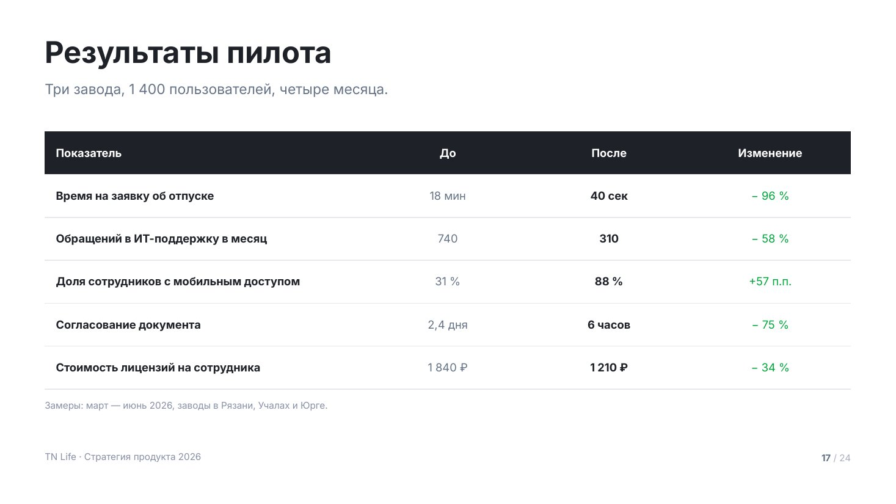
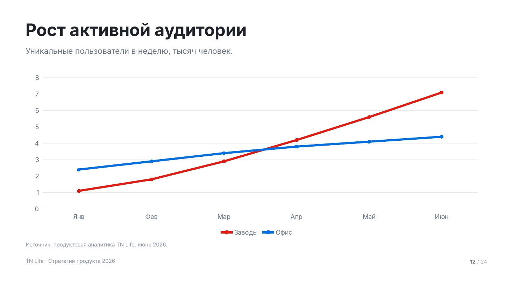
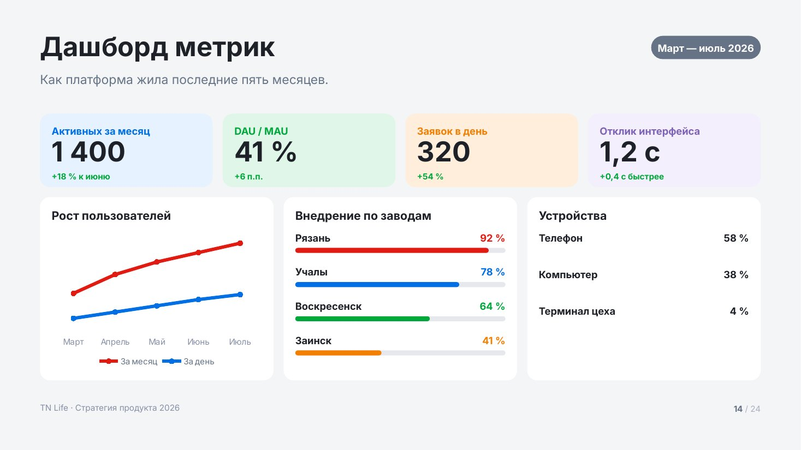

# Данные

Цифры, таблицы и диаграммы. Диаграммы — нативные объекты PowerPoint: их можно
открыть и поправить данные, это не картинки.

Сниппеты предполагают подключённый пролог — см. [README.md](README.md).

## `metrics` — ключевые цифры


Две–четыре цифры, которые надо запомнить. Самый сильный макет деки — им
открывают блок про проблему и им же закрывают блок про результат.

Карточка нейтральная, цвет несёт сама цифра. Единица набирается вдвое мельче
числа, кегль числа общий для всего ряда, подписи выровнены по одной линии —
поэтому ряд читается как одна таблица, а не как три разные плашки.
`fill: 'dark'` делает карточку тёмной: так выделяют худший или самый тревожный
показатель.

| Поле | Значение |
|---|---|
| `title` | заголовок слайда |
| `lead` | лид: откуда цифры и за какой период |
| `items[].value` | само число, строкой |
| `items[].unit` | единица: «мин», «%», «₽» |
| `items[].title` | что означает цифра |
| `items[].note` | уточнение, 1–2 строки |
| `items[].icon` | имя иконки |
| `items[].tone` | свой акцент |
| `items[].fill` | `dark` — тёмная карточка |

<details><summary>Сниппет</summary>

```js
async function metrics(p, d) {
  const s = p.addSlide();
  const light = d.tone === 'light';
  s.background = { color: TN.hex(light ? C.surface : C.bg) };
  const y0 = TN.header(s, d);

  const items = d.items.slice(0, 4);
  const gap = 32, pd = 44, tileW = 64;
  const cw = Math.floor((CW - gap * (items.length - 1)) / items.length), iw = cw - pd * 2;

  // кегль числа — общий для ряда, по самому длинному
  let vs = T.metric;
  for (const it of items) {
    const f = TN.fit(String(it.value) + (it.unit ? ' ' + it.unit : ''), { w: iw, h: 220, size: T.metric, min: 60, bold: true, lh: 1 });
    vs = Math.min(vs, f.size);
  }
  // подпись и уточнение — одной высоты во всём ряду, иначе строки разъедутся
  let capH = 0;
  for (const it of items) {
    const tH = TN.blockH(it.title, iw, T.h4, true, 1.2);
    const nH = it.note ? TN.blockH(it.note, iw, T.small, false, 1.45) + 12 : 0;
    capH = Math.max(capH, tH + nH);
  }
  const icons = items.some((it) => it.icon);
  const need = pd * 2 + (icons ? tileW + 32 : 0) + Math.round(vs * 1.1) + 32 + capH;
  const ch = TN.boxH(need, TN.contentBottom() - y0, { grow: 1.06 });
  const top = TN.place(y0, TN.contentBottom(), ch, 0.32);

  for (let i = 0; i < items.length; i++) {
    const it = items[i];
    const a = TN.accent(i, it.tone);
    const dark = it.fill === 'dark';
    const x = MX + i * (cw + gap);
    TN.rect(s, p, { x, y: top, w: cw, h: ch, r: TN.R.big, fill: dark ? C.deep : light ? C.bg : C.surface });

    if (icons) await TN.tile(s, p, { x: x + pd, y: top + pd, size: tileW,
      fill: dark ? C.chip : light ? C.surface : C.bg, icon: it.icon, color: dark ? C.onDeep : a.solid });

    const vy = top + pd + (icons ? tileW + 32 : 0);
    s.addText([
      { text: String(it.value), options: { bold: true, fontSize: TN.pt(vs), color: TN.hex(dark ? C.onDeep : a.solid) } },
      ...(it.unit ? [{ text: ' ' + it.unit, options: { bold: true, fontSize: TN.pt(Math.round(vs * 0.46)), color: TN.hex(dark ? C.onDeep : a.solid) } }] : []),
    ], { x: px(x + pd), y: px(vy), w: px(iw), h: px(vs * 1.1), isTextBox: true, margin: 0, fontFace: TN.FONT, valign: 'bottom', lineSpacing: TN.pt(vs) });

    const by = top + ch - pd - capH;                 // подписи на общей линии
    const tH = TN.blockH(it.title, iw, T.h4, true, 1.2);
    TN.txt(s, it.title, { x: x + pd, y: by, w: iw, h: tH + 6, size: T.h4, bold: true, lh: 1.2, color: dark ? C.onDeep : C.ink });
    if (it.note) TN.txt(s, it.note, { x: x + pd, y: by + tH + 12, w: iw, h: capH - tH, size: T.small, lh: 1.45, color: dark ? C.onDeepDim : C.muted });
  }
  chrome(s, p);
}
```
</details>

Пример вызова:

```js
await metrics(p, {
    title: 'Цена разрозненности',
    lead: 'Замеры на трёх заводах в апреле 2026 года.',
    items: [
      { value: '40', unit: 'мин', title: 'в день на переключение', note: 'Между почтой, ERP, мессенджером и таск-трекером.', icon: 'clock-light' },
      { value: '5', title: 'систем на одну задачу', note: 'Заявка на отпуск проходит через четыре интерфейса.', icon: 'applications-light', tone: 'blue' },
      { value: '31', unit: '%', title: 'сотрудников на смене', note: 'Не имеют рабочего доступа с телефона.', icon: 'phone-light', fill: 'dark' },
    ],
  });
```

## `table` — таблица



Когда параметров много и их надо сравнить по строкам. Шапка тёмная, строки
разделены волосяной линейкой, первая колонка полужирная. Заливок через одну нет:
на проекции они дают муар, а линейки — нет.

До 8 строк — дальше таблицу не читают с проекции. Ячейку можно раскрасить по смыслу:
`{ text: '−96 %', tone: 'green' }`. Зелёный — улучшение, красный — ухудшение,
независимо от того, что красный фирменный.

| Поле | Значение |
|---|---|
| `title` | заголовок слайда |
| `lead` | лид |
| `columns[]` | `{ title, w, align, strong }`, `w` — доля ширины в процентах |
| `rows[][]` | строка или `{ text, tone, bold }` |
| `note` | источник данных под таблицей |
| `dense` | `true` — мельче кегль, если строк много |

<details><summary>Сниппет</summary>

```js
function table(p, d) {
  const s = p.addSlide();
  s.background = { color: TN.hex(C.bg) };
  const y0 = TN.header(s, d);
  const bottom = TN.contentBottom() - (d.note ? 46 : 0);
  const size = d.dense ? T.small - 2 : T.small;

  const head = d.columns.map((c) => ({
    text: typeof c === 'string' ? c : c.title,
    options: { bold: true, color: TN.hex(C.onDeep), fill: { color: TN.hex(C.deep) }, fontSize: TN.pt(size),
      align: c.align || 'left', valign: 'middle', margin: [TN.pt(16), TN.pt(24), TN.pt(16), TN.pt(24)] },
  }));
  const body = d.rows.map((r) => r.map((cell, ci) => {
    const col = d.columns[ci];
    const obj = cell && typeof cell === 'object';
    const a = obj && cell.tone ? TN.accent(0, cell.tone) : null;
    return {
      text: String(obj ? cell.text : cell),
      options: {
        color: TN.hex(a ? a.solid : (col.strong || ci === 0) ? C.ink : C.muted),
        bold: !!(col.strong || ci === 0 || (obj && cell.bold)),
        fill: { color: TN.hex(C.bg) },
        fontSize: TN.pt(size), align: col.align || 'left', valign: 'middle',
        margin: [TN.pt(14), TN.pt(24), TN.pt(14), TN.pt(24)],
      },
    };
  }));

  // высота строки считается, а таблица ставится блоком — не растягивается на зону
  const rowH = Math.min(92, Math.max(56, Math.floor((bottom - y0) / (d.rows.length + 1))));
  const tableH = rowH * (d.rows.length + 1);
  const top = TN.place(y0, bottom, tableH, 0.24);

  const widths = d.columns.map((c) => c.w || null);
  const known = widths.filter(Boolean).reduce((a, b) => a + b, 0);
  const rest = (CW - CW * known / 100) / Math.max(widths.filter((x) => !x).length, 1);
  s.addTable([head, ...body], {
    x: px(MX), y: px(top), w: px(CW),
    colW: widths.map((w) => (w ? px(CW * w / 100) : px(rest))),
    // только горизонтальные волосяные линейки: [верх, право, низ, лево]
    border: [{ type: 'none' }, { type: 'none' }, { type: 'solid', color: TN.hex(C.line), pt: 1 }, { type: 'none' }],
    autoPage: false, fontFace: TN.FONT, rowH: px(rowH),
  });
  if (d.note) TN.txt(s, d.note, { x: MX, y: top + tableH + 22, w: CW, h: 32, size: T.caption, color: C.soft });
  chrome(s, p);
}
```
</details>

Пример вызова:

```js
table(p, {
    title: 'Результаты пилота',
    lead: 'Три завода, 1 400 пользователей, четыре месяца.',
    columns: [
      { title: 'Показатель', w: 40 },
      { title: 'До', align: 'center' },
      { title: 'После', align: 'center', strong: true },
      { title: 'Изменение', align: 'center' },
    ],
    rows: [
      ['Время на заявку об отпуске', '18 мин', '40 сек', { text: '− 96 %', tone: 'green' }],
      ['Обращений в ИТ-поддержку в месяц', '740', '310', { text: '− 58 %', tone: 'green' }],
      ['Доля сотрудников с мобильным доступом', '31 %', '88 %', { text: '+57 п.п.', tone: 'green' }],
      ['Согласование документа', '2,4 дня', '6 часов', { text: '− 75 %', tone: 'green' }],
      ['Стоимость лицензий на сотрудника', '1 840 ₽', '1 210 ₽', { text: '− 34 %', tone: 'green' }],
    ],
    note: 'Замеры: март — июнь 2026, заводы в Рязани, Учалах и Юрге.',
  });
```

## `chart` — диаграмма



Динамика, распределение, доли. Виды: `column`, `bar`, `line`, `area`, `pie`,
`doughnut`.

По умолчанию ось значений скрыта, а числа подписаны прямо у столбцов и точек:
на проекции никто не считывает значение по сетке, зато график встаёт ровно
по левому полю слайда. `axis: true` возвращает ось и сетку и убирает подписи —
так делают, когда важна форма кривой, а не отдельные значения. У линий и областей
с несколькими сериями ось включается сама.

Одна серия — один фирменный красный, разноцветные столбцы одной серии это ошибка.
Несколько серий — палитра акцентов, легенда появляется сама. У горизонтальных `bar`
порядок категорий разворачивается, чтобы первая была сверху.

Чего не делать: объёмных диаграмм, круговых больше чем на 5 секторов, двух осей
на одном графике.

| Поле | Значение |
|---|---|
| `title` | заголовок слайда |
| `lead` | лид: единицы измерения |
| `chart.kind` | вид диаграммы |
| `chart.categories` | подписи по оси |
| `chart.series[]` | `{ name, values }` |
| `chart.axis` | `true` — показать ось значений и сетку |
| `chart.stacked` | `true` — накопительная |
| `chart.colors` | свои цвета |
| `chart.showValue` | `false` — убрать подписи значений |
| `chart.format` | формат чисел, например `0.0` |
| `note` | источник данных |

<details><summary>Сниппет</summary>

```js
function chart(p, d) {
  const s = p.addSlide();
  s.background = { color: TN.hex(C.bg) };
  const y0 = TN.header(s, d);
  const bottom = TN.contentBottom() - (d.note ? 44 : 0);
  const cfg = d.chart;
  const kind = cfg.kind || 'column';

  // у горизонтальных баров PowerPoint рисует первую категорию снизу — разворачиваем
  const flip = kind === 'bar';
  const cats = flip ? cfg.categories.slice().reverse() : cfg.categories;
  const series = cfg.series.map((sr) => ({ name: sr.name || '', labels: cats, values: flip ? sr.values.slice().reverse() : sr.values }));

  const round = kind === 'pie' || kind === 'doughnut';
  const line = kind === 'line' || kind === 'area';
  const axis = cfg.axis === true || (line && series.length > 1);
  const showValue = cfg.showValue != null ? cfg.showValue : !axis;

  const palette = TN.ACCENTS.map((a) => a.solid);       // акценты активной темы
  const colors = (cfg.colors || (series.length === 1 && !round ? [C.accent] : palette)).map(TN.hex);
  const type = { column: p.ChartType.bar, bar: p.ChartType.bar, line: p.ChartType.line,
    area: p.ChartType.area, pie: p.ChartType.pie, doughnut: p.ChartType.doughnut }[kind];

  s.addChart(type, series, {
    x: px(MX), y: px(y0), w: px(CW), h: px(bottom - y0),
    chartColors: colors, varyColors: round,
    barDir: flip ? 'bar' : 'col', barGapWidthPct: 80,
    ...(cfg.stacked ? { barGrouping: 'stacked' } : {}),
    showLegend: series.length > 1 || round, legendPos: 'b',
    legendFontSize: TN.pt(T.small), legendColor: TN.hex(C.muted), legendFontFace: TN.FONT,
    showValue, dataLabelPosition: round ? 'bestFit' : line ? 't' : cfg.stacked ? 'ctr' : 'outEnd',
    dataLabelFontSize: TN.pt(T.caption), dataLabelFontFace: TN.FONT,
    dataLabelColor: TN.hex(round ? C.onAccent : C.muted), dataLabelFormatCode: cfg.format,
    catAxisLabelColor: TN.hex(C.muted), catAxisLabelFontSize: TN.pt(T.small), catAxisLabelFontFace: TN.FONT,
    valAxisLabelColor: TN.hex(C.muted), valAxisLabelFontSize: TN.pt(T.small), valAxisLabelFontFace: TN.FONT,
    valAxisHidden: !axis && !round,
    catGridLine: { style: 'none' }, valGridLine: axis ? { color: TN.hex(C.line), size: 1 } : { style: 'none' },
    catAxisLineShow: false, valAxisLineShow: false,
    ...(line ? { lineSize: 4, lineSmooth: false, showMarker: true, markerSize: 8 } : {}),
    ...(kind === 'doughnut' ? { holeSize: 62 } : {}),
  });
  if (d.note) TN.txt(s, d.note, { x: MX, y: bottom + 12, w: CW, h: 32, size: T.caption, color: C.soft });
  chrome(s, p);
}
```
</details>

Пример вызова:

```js
chart(p, {
    title: 'Рост активной аудитории',
    lead: 'Уникальные пользователи в неделю, тысяч человек.',
    chart: {
      kind: 'line',
      categories: ['Янв', 'Фев', 'Мар', 'Апр', 'Май', 'Июн'],
      series: [
        { name: 'Заводы', values: [1.1, 1.8, 2.9, 4.2, 5.6, 7.1] },
        { name: 'Офис', values: [2.4, 2.9, 3.4, 3.8, 4.1, 4.4] },
      ],
    },
    note: 'Источник: продуктовая аналитика TN Life, июнь 2026.',
  });
```

## `dashboard` — сводка показателей



Панель из плиток и панелей: наверху — четыре числа, под ними — разрезы.
Нужна на регулярном статусе, где один слайд отвечает сразу на несколько
вопросов: сколько, куда растёт, где отстаём.

Это единственный макет, где на слайде больше одного тезиса — и поэтому
единственный, который не ставят в середину рассказа: он либо открывает статус,
либо закрывает его. Если показателей два-три, это `metrics`, а не дашборд.

Панель бывает трёх видов: `bars` — рейтинг со шкалами, `chart` — нативная
диаграмма, `list` — пары «строка — значение».

| Поле | Значение |
|---|---|
| `title` | заголовок слайда |
| `lead` | лид |
| `badge` | плашка периода справа от заголовка |
| `tiles[]` | `{ label, value, delta, tone }`, до 4 |
| `panels[]` | `{ title, kind, rows[], chart }`, до 3 |
| `panels[].rows[]` | `bars`: `{ label, value, tone }`, `list`: `{ label, value }` |

<details><summary>Сниппет</summary>

```js
function dashboard(p, d) {
  const s = p.addSlide();
  s.background = { color: TN.hex(C.surface) };
  const y0 = TN.header(s, d);
  const bottom = TN.contentBottom();

  if (d.badge) {
    const w = Math.min(420, TN.blockH(d.badge, 9999, T.small, true, 1) * 0 + 40 + d.badge.length * T.small * 0.58);
    TN.pill(s, p, { x: MX + CW - w, y: MT + 6, w, h: 56, size: T.small, fill: C.deepSoft, color: C.onDeep, text: d.badge });
  }

  const tiles = (d.tiles || []).slice(0, 4);
  const panels = (d.panels || []).slice(0, 3);
  const gap = 24, pd = 28;
  const tileH = 176;
  const tw = Math.floor((CW - gap * (tiles.length - 1)) / Math.max(tiles.length, 1));
  const panelH = Math.min(440, bottom - y0 - (tiles.length ? tileH + gap : 0));
  const top = TN.place(y0, bottom, (tiles.length ? tileH + gap : 0) + panelH, 0.28);

  tiles.forEach((it, i) => {
    const a = TN.accent(i, it.tone);
    const x = MX + i * (tw + gap);
    TN.rect(s, p, { x, y: top, w: tw, h: tileH, r: TN.R.card, fill: a.tint });
    TN.txt(s, it.label, { x: x + pd, y: top + 26, w: tw - pd * 2, h: 32, size: T.small, bold: true, color: a.solid });
    const vf = TN.fit(String(it.value), { w: tw - pd * 2, h: 80, size: 66, min: 40, bold: true, lh: 1 });
    const vy = top + 62;
    TN.txt(s, String(it.value), { x: x + pd, y: vy, w: tw - pd * 2, h: vf.size * 1.1, size: vf.size, bold: true, lh: 1 });
    if (it.delta) TN.txt(s, it.delta, { x: x + pd, y: vy + Math.round(vf.size * 1.05) + 6, w: tw - pd * 2, h: 32, size: T.caption, bold: true,
      color: TN.accent(0, String(it.delta).trim().startsWith('−') || String(it.delta).trim().startsWith('-') ? 'red' : 'green').solid });
  });

  const py = top + (tiles.length ? tileH + gap : 0);
  const pw = Math.floor((CW - gap * (panels.length - 1)) / Math.max(panels.length, 1));
  panels.forEach((pn, i) => {
    const x = MX + i * (pw + gap);
    TN.rect(s, p, { x, y: py, w: pw, h: panelH, r: TN.R.card, fill: C.bg });
    TN.txt(s, pn.title, { x: x + pd, y: py + 26, w: pw - pd * 2, h: 36, size: T.h4, bold: true });
    const iy = py + 82, ih = panelH - 82 - pd;

    if (pn.kind === 'chart' && pn.chart) {
      const cfg = pn.chart;
      const series = cfg.series.map((sr) => ({ name: sr.name || '', labels: cfg.categories, values: sr.values }));
      s.addChart({ line: p.ChartType.line, area: p.ChartType.area, column: p.ChartType.bar,
        doughnut: p.ChartType.doughnut, pie: p.ChartType.pie }[cfg.kind || 'line'], series, {
        x: px(x + pd - 8), y: px(iy - 8), w: px(pw - pd * 2 + 16), h: px(ih + 8),
        chartColors: (cfg.colors || TN.ACCENTS.map((a) => a.solid)).map(TN.hex),
        varyColors: cfg.kind === 'pie' || cfg.kind === 'doughnut',
        showLegend: series.length > 1, legendPos: 'b', legendFontSize: TN.pt(T.caption),
        legendColor: TN.hex(C.muted), legendFontFace: TN.FONT,
        showValue: false, valAxisHidden: true,
        catAxisLabelColor: TN.hex(C.soft), catAxisLabelFontSize: TN.pt(T.caption), catAxisLabelFontFace: TN.FONT,
        catGridLine: { style: 'none' }, valGridLine: { style: 'none' },
        catAxisLineShow: false, valAxisLineShow: false,
        ...(cfg.kind === 'line' || !cfg.kind ? { lineSize: 4, showMarker: true, markerSize: 7 } : {}),
        ...(cfg.kind === 'doughnut' ? { holeSize: 62 } : {}),
      });
      return;
    }

    const rows = (pn.rows || []).slice(0, 5);
    const step = Math.min(88, Math.floor(ih / Math.max(rows.length, 1)));
    rows.forEach((r, j) => {
      const a = TN.accent(j, r.tone);
      const y = iy + j * step;
      TN.txt(s, r.label, { x: x + pd, y, w: pw - pd * 2 - 140, h: 32, size: T.small, bold: true });
      TN.txt(s, String(r.value) + (pn.kind === 'bars' ? ' %' : ''), { x: x + pw - pd - 140, y, w: 140, h: 32,
        size: T.small, bold: true, color: pn.kind === 'bars' ? a.solid : C.ink, align: 'right' });
      if (pn.kind === 'bars') {
        const bw = pw - pd * 2, by = y + 40;
        TN.rect(s, p, { x: x + pd, y: by, w: bw, h: 12, r: 6, fill: C.line });
        TN.rect(s, p, { x: x + pd, y: by, w: Math.max(12, bw * Math.min(1, r.value / 100)), h: 12, r: 6, fill: a.solid });
      }
    });
  });
  chrome(s, p);
}
```
</details>

Пример вызова:

```js
dashboard(p, {
    title: 'Дашборд метрик',
    lead: 'Как платформа жила последние пять месяцев.',
    badge: 'Март — июль 2026',
    tiles: [
      { label: 'Активных за месяц', value: '1 400', delta: '+18 % к июню', tone: 'blue' },
      { label: 'DAU / MAU', value: '41 %', delta: '+6 п.п.', tone: 'green' },
      { label: 'Заявок в день', value: '320', delta: '+54 %', tone: 'orange' },
      { label: 'Отклик интерфейса', value: '1,2 с', delta: '− 0,4 с', tone: 'purple' },
    ],
    panels: [
      { title: 'Рост пользователей', kind: 'chart', chart: {
        kind: 'line', categories: ['Март', 'Апрель', 'Май', 'Июнь', 'Июль'],
        series: [{ name: 'За месяц', values: [0.6, 0.9, 1.1, 1.25, 1.4] }, { name: 'За день', values: [0.2, 0.3, 0.4, 0.5, 0.58] }] } },
      { title: 'Внедрение по заводам', kind: 'bars', rows: [
        { label: 'Рязань', value: 92 }, { label: 'Учалы', value: 78, tone: 'blue' },
        { label: 'Воскресенск', value: 64, tone: 'green' }, { label: 'Заинск', value: 41, tone: 'orange' }] },
      { title: 'Устройства', kind: 'list', rows: [
        { label: 'Телефон', value: '58 %' }, { label: 'Компьютер', value: '38 %' }, { label: 'Терминал цеха', value: '4 %' }] },
    ],
  });
```
