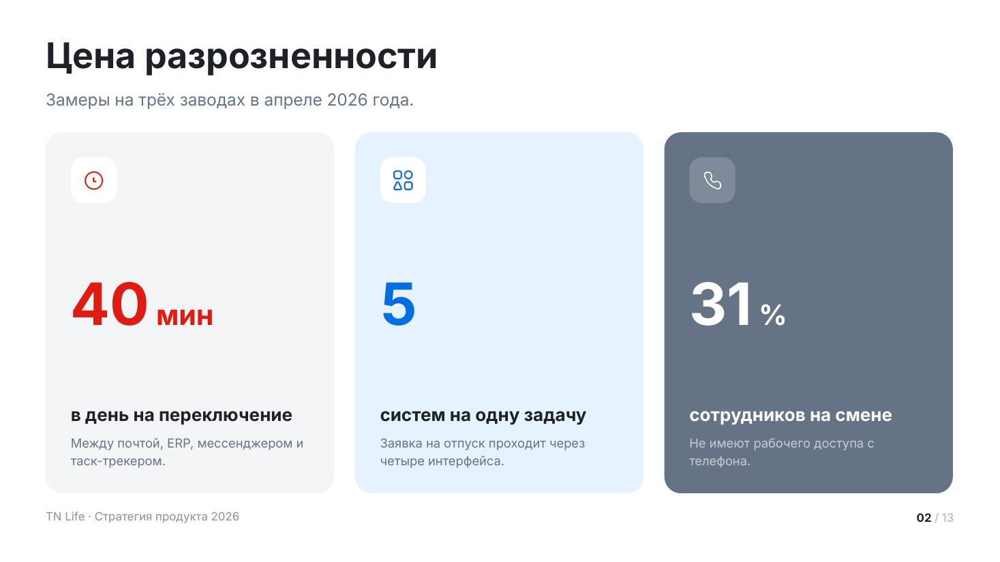
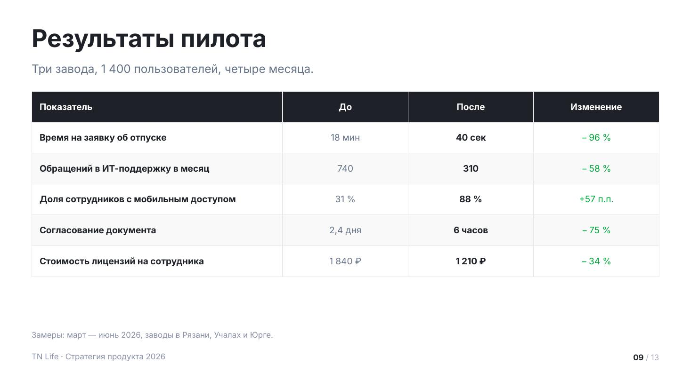
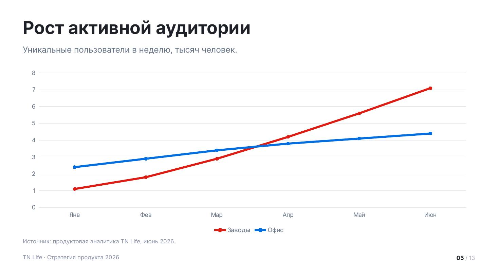

# Данные

Цифры, таблицы и диаграммы. Диаграммы — нативные объекты PowerPoint: их можно
открыть и поправить данные, это не картинки.

Сниппеты предполагают подключённый пролог — см. [README.md](README.md).

## `metrics` — ключевые цифры



Две–четыре цифры, которые надо запомнить. Самый сильный макет деки — им
открывают блок про проблему и им же закрывают блок про результат.

Единица набирается вдвое мельче цифры. Подписи в ряду выравниваются по одной линии,
даже если тексты разной длины. `fill: 'dark'` делает карточку тёмной — так выделяют
худший или самый тревожный показатель.

| Поле | Значение |
|---|---|
| `title` | заголовок слайда |
| `lead` | лид: откуда цифры и за какой период |
| `items[].value` | само число, строкой |
| `items[].unit` | единица: «мин», «%», «₽» |
| `items[].title` | что означает цифра |
| `items[].note` | уточнение, 1–2 строки |
| `items[].icon` | имя иконки |
| `items[].tone` | свой акцент |
| `items[].fill` | `dark` — тёмная карточка |

<details><summary>Сниппет</summary>

```js
async function metrics(p, d) {
  const s = p.addSlide();
  s.background = { color: TN.hex(d.tone === 'light' ? C.surface : C.bg) };
  const y0 = TN.header(s, d);

  const items = d.items.slice(0, 4);
  const gap = 40, pdx = 48, pdy = 48, chip = 88;
  const cw = Math.floor((CW - gap * (items.length - 1)) / items.length);
  const chH = TN.contentBottom() - y0;

  // единая высота нижнего блока — иначе подписи в ряду разъедутся
  let blockHeight = 0;
  for (const it of items) {
    const tH = TN.blockH(it.title, cw - pdx * 2, 34, true, 1.15);
    const nH = it.note ? TN.blockH(it.note, cw - pdx * 2, T.small, false, 1.45) + 14 : 0;
    blockHeight = Math.max(blockHeight, tH + nH);
  }

  for (let i = 0; i < items.length; i++) {
    const it = items[i];
    const a = TN.accent(i, it.tone);
    const dark = it.fill === 'dark';
    const x = MX + i * (cw + gap);
    TN.rect(s, p, { x, y: y0, w: cw, h: chH, r: 32, fill: dark ? C.deepSoft : i === 0 && !it.tone ? C.surface : a.tint });

    if (it.icon) {
      TN.rect(s, p, { x: x + pdx, y: y0 + pdy, w: chip, h: chip, r: 24, fill: dark ? C.chip : C.bg });
      await TN.putIcon(s, it.icon, dark ? C.onDeep : a.solid, { x: x + pdx + 22, y: y0 + pdy + 22, w: 44 });
    }

    const by = y0 + chH - pdy - blockHeight;
    const vf = TN.fit(String(it.value), { w: cw - pdx * 2, h: 150, size: T.metric, min: 64, bold: true, lh: 1 });
    const zoneTop = y0 + pdy + (it.icon ? chip + 16 : 0);
    const vy = Math.max(zoneTop, zoneTop + (by - 28 - zoneTop - vf.size * 1.05) / 2);
    s.addText([
      { text: String(it.value), options: { bold: true, fontSize: TN.pt(vf.size), color: TN.hex(dark ? C.onDeep : a.solid) } },
      ...(it.unit ? [{ text: ' ' + it.unit, options: { bold: true, fontSize: TN.pt(vf.size * 0.48), color: TN.hex(dark ? C.onDeep : a.solid) } }] : []),
    ], { x: px(x + pdx), y: px(vy), w: px(cw - pdx * 2), h: px(vf.size * 1.15), isTextBox: true, margin: 0, fontFace: TN.FONT, valign: 'bottom', lineSpacing: TN.pt(vf.size) });

    const tH = TN.blockH(it.title, cw - pdx * 2, 34, true, 1.15);
    TN.txt(s, it.title, { x: x + pdx, y: by, w: cw - pdx * 2, h: tH + 4, size: 34, bold: true, lh: 1.15, color: dark ? C.onDeep : C.ink });
    if (it.note) TN.txt(s, it.note, { x: x + pdx, y: by + tH + 14, w: cw - pdx * 2, h: blockHeight - tH - 10, size: T.small, lh: 1.45, color: dark ? C.onDeepDim : C.muted });
  }
  chrome(s, p);
}
```
</details>

Пример вызова:

```js
await metrics(p, {
    title: 'Цена разрозненности',
    lead: 'Замеры на трёх заводах в апреле 2026 года.',
    items: [
      { value: '40', unit: 'мин', title: 'в день на переключение', note: 'Между почтой, ERP, мессенджером и таск-трекером.', icon: 'clock-light' },
      { value: '5', title: 'систем на одну задачу', note: 'Заявка на отпуск проходит через четыре интерфейса.', icon: 'applications-light', tone: 'blue' },
      { value: '31', unit: '%', title: 'сотрудников на смене', note: 'Не имеют рабочего доступа с телефона.', icon: 'phone-light', fill: 'dark' },
    ],
  });
```

## `table` — таблица



Когда параметров много и их надо сравнить по строкам. Шапка тёмная, строки
через одну подсвечены, первая колонка полужирная.

До 8 строк — дальше таблицу не читают с проекции. Ячейку можно раскрасить по смыслу:
`{ text: '−96 %', tone: 'green' }`. Зелёный — улучшение, красный — ухудшение,
независимо от того, что красный фирменный.

| Поле | Значение |
|---|---|
| `title` | заголовок слайда |
| `lead` | лид |
| `columns[]` | `{ title, w, align, strong }`, `w` — доля ширины в процентах |
| `rows[][]` | строка или `{ text, tone, bold }` |
| `note` | источник данных под таблицей |
| `dense` | `true` — мельче кегль, если строк много |

<details><summary>Сниппет</summary>

```js
function table(p, d) {
  const s = p.addSlide();
  s.background = { color: TN.hex(C.bg) };
  const y0 = TN.header(s, d);
  const bottom = TN.contentBottom();

  const head = d.columns.map((c) => ({
    text: typeof c === 'string' ? c : c.title,
    options: { bold: true, color: TN.hex(C.onDeep), fill: { color: TN.hex(C.deep) }, fontSize: TN.pt(25),
      align: (c.align) || 'left', valign: 'middle', margin: [TN.pt(18), TN.pt(22), TN.pt(18), TN.pt(22)] },
  }));
  const body = d.rows.map((r, ri) => r.map((cell, ci) => {
    const col = d.columns[ci];
    const obj = cell && typeof cell === 'object';
    const a = obj && cell.tone ? TN.accent(0, cell.tone) : null;
    return {
      text: String(obj ? cell.text : cell),
      options: {
        color: TN.hex(a ? a.solid : (col.strong || ci === 0) ? C.ink : C.muted),
        bold: !!(col.strong || ci === 0 || (obj && cell.bold)),
        fill: { color: TN.hex(ri % 2 ? C.surfaceAlt : C.bg) },
        fontSize: TN.pt(d.dense ? 22 : 25), align: col.align || 'left', valign: 'middle',
        margin: [TN.pt(16), TN.pt(22), TN.pt(16), TN.pt(22)],
      },
    };
  }));

  const widths = d.columns.map((c) => c.w || null);
  const known = widths.filter(Boolean).reduce((a, b) => a + b, 0);
  const rest = (CW - CW * known / 100) / Math.max(widths.filter((x) => !x).length, 1);
  s.addTable([head, ...body], {
    x: px(MX), y: px(y0), w: px(CW),
    colW: widths.map((w) => (w ? px(CW * w / 100) : px(rest))),
    border: { type: 'solid', color: TN.hex(C.n20), pt: 1 },
    autoPage: false, fontFace: TN.FONT,
    rowH: px(Math.min(86, Math.max(58, (bottom - y0 - 70) / d.rows.length))),
  });
  if (d.note) TN.txt(s, d.note, { x: MX, y: bottom - 30, w: CW, h: 34, size: T.caption, color: C.n50 });
  chrome(s, p);
}
```
</details>

Пример вызова:

```js
table(p, {
    title: 'Результаты пилота',
    lead: 'Три завода, 1 400 пользователей, четыре месяца.',
    columns: [
      { title: 'Показатель', w: 40 },
      { title: 'До', align: 'center' },
      { title: 'После', align: 'center', strong: true },
      { title: 'Изменение', align: 'center' },
    ],
    rows: [
      ['Время на заявку об отпуске', '18 мин', '40 сек', { text: '− 96 %', tone: 'green' }],
      ['Обращений в ИТ-поддержку в месяц', '740', '310', { text: '− 58 %', tone: 'green' }],
      ['Доля сотрудников с мобильным доступом', '31 %', '88 %', { text: '+57 п.п.', tone: 'green' }],
      ['Согласование документа', '2,4 дня', '6 часов', { text: '− 75 %', tone: 'green' }],
      ['Стоимость лицензий на сотрудника', '1 840 ₽', '1 210 ₽', { text: '− 34 %', tone: 'green' }],
    ],
    note: 'Замеры: март — июнь 2026, заводы в Рязани, Учалах и Юрге.',
  });
```

## `chart` — диаграмма



Динамика, распределение, доли. Виды: `column`, `bar`, `line`, `area`, `pie`,
`doughnut`.

Одна серия — один фирменный красный, разноцветные столбцы одной серии это ошибка.
Несколько серий — палитра акцентов, легенда появляется сама. У горизонтальных `bar`
порядок категорий разворачивается, чтобы первая была сверху: PowerPoint рисует их
снизу вверх.

Чего не делать: объёмных диаграмм, круговых больше чем на 5 секторов, двух осей
на одном графике.

| Поле | Значение |
|---|---|
| `title` | заголовок слайда |
| `lead` | лид: единицы измерения |
| `chart.kind` | вид диаграммы |
| `chart.categories` | подписи по оси |
| `chart.series[]` | `{ name, values }` |
| `chart.stacked` | `true` — накопительная |
| `chart.colors` | свои цвета |
| `chart.showValue` | `false` — убрать подписи значений |
| `chart.format` | формат чисел, например `0.0` |
| `note` | источник данных |

<details><summary>Сниппет</summary>

```js
function chart(p, d) {
  const s = p.addSlide();
  s.background = { color: TN.hex(C.bg) };
  const y0 = TN.header(s, d);
  const bottom = TN.contentBottom();
  const cfg = d.chart;
  const kind = cfg.kind || 'column';

  // у горизонтальных баров PowerPoint рисует первую категорию снизу — разворачиваем
  const flip = kind === 'bar';
  const cats = flip ? cfg.categories.slice().reverse() : cfg.categories;
  const series = cfg.series.map((sr) => ({ name: sr.name || '', labels: cats, values: flip ? sr.values.slice().reverse() : sr.values }));

  const round = kind === 'pie' || kind === 'doughnut';
  const palette = TN.ACCENTS.map((a) => a.solid);       // акценты активной темы
  const colors = (cfg.colors || (series.length === 1 && !round ? [C.accent] : palette)).map(TN.hex);
  const type = { column: p.ChartType.bar, bar: p.ChartType.bar, line: p.ChartType.line,
    area: p.ChartType.area, pie: p.ChartType.pie, doughnut: p.ChartType.doughnut }[kind];

  s.addChart(type, series, {
    x: px(MX), y: px(y0), w: px(CW), h: px(bottom - y0 - (d.note ? 40 : 0)),
    chartColors: colors, varyColors: round,
    barDir: kind === 'bar' ? 'bar' : 'col', barGapWidthPct: 60,
    ...(cfg.stacked ? { barGrouping: 'stacked' } : {}),
    showLegend: series.length > 1 || round, legendPos: 'b', legendFontSize: TN.pt(24), legendColor: TN.hex(C.n60), legendFontFace: TN.FONT,
    showValue: cfg.showValue !== false && kind !== 'line' && kind !== 'area',
    dataLabelPosition: round ? 'bestFit' : cfg.stacked ? 'ctr' : 'outEnd',
    dataLabelFontSize: TN.pt(22), dataLabelFontFace: TN.FONT,
    dataLabelColor: TN.hex(round ? C.onAccent : C.muted),
    dataLabelFormatCode: cfg.format,
    catAxisLabelColor: TN.hex(C.n60), catAxisLabelFontSize: TN.pt(23), catAxisLabelFontFace: TN.FONT,
    valAxisLabelColor: TN.hex(C.n60), valAxisLabelFontSize: TN.pt(23), valAxisLabelFontFace: TN.FONT,
    catGridLine: { style: 'none' }, valGridLine: { color: TN.hex(C.n20), size: 1 },
    catAxisLineShow: false, valAxisLineShow: false,
    ...(kind === 'line' ? { lineSize: 4, lineSmooth: false, showMarker: true, markerSize: 8 } : {}),
    ...(kind === 'doughnut' ? { holeSize: 60 } : {}),
  });
  if (d.note) TN.txt(s, d.note, { x: MX, y: bottom - 32, w: CW, h: 34, size: T.caption, color: C.n50 });
  chrome(s, p);
}
```
</details>

Пример вызова:

```js
chart(p, {
    title: 'Рост активной аудитории',
    lead: 'Уникальные пользователи в неделю, тысяч человек.',
    chart: {
      kind: 'line',
      categories: ['Янв', 'Фев', 'Мар', 'Апр', 'Май', 'Июн'],
      series: [
        { name: 'Заводы', values: [1.1, 1.8, 2.9, 4.2, 5.6, 7.1] },
        { name: 'Офис', values: [2.4, 2.9, 3.4, 3.8, 4.1, 4.4] },
      ],
    },
    note: 'Источник: продуктовая аналитика TN Life, июнь 2026.',
  });
```
