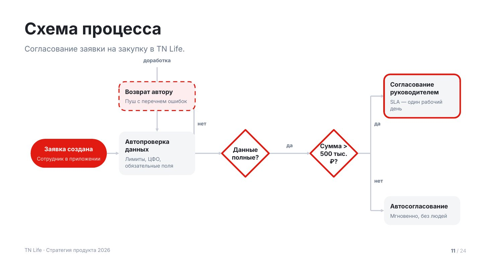
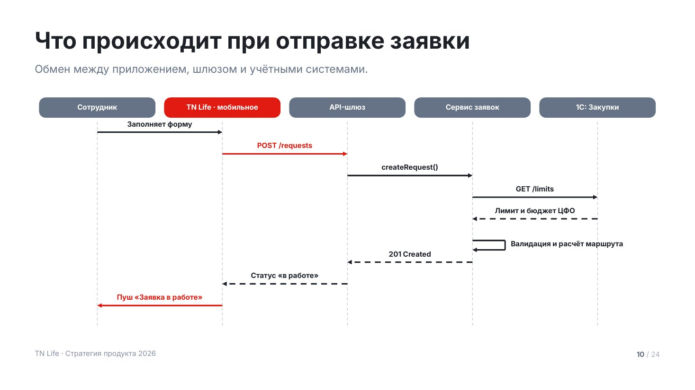
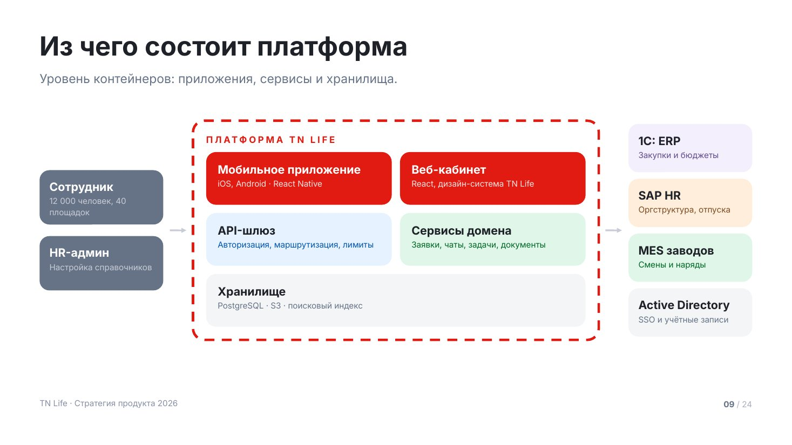
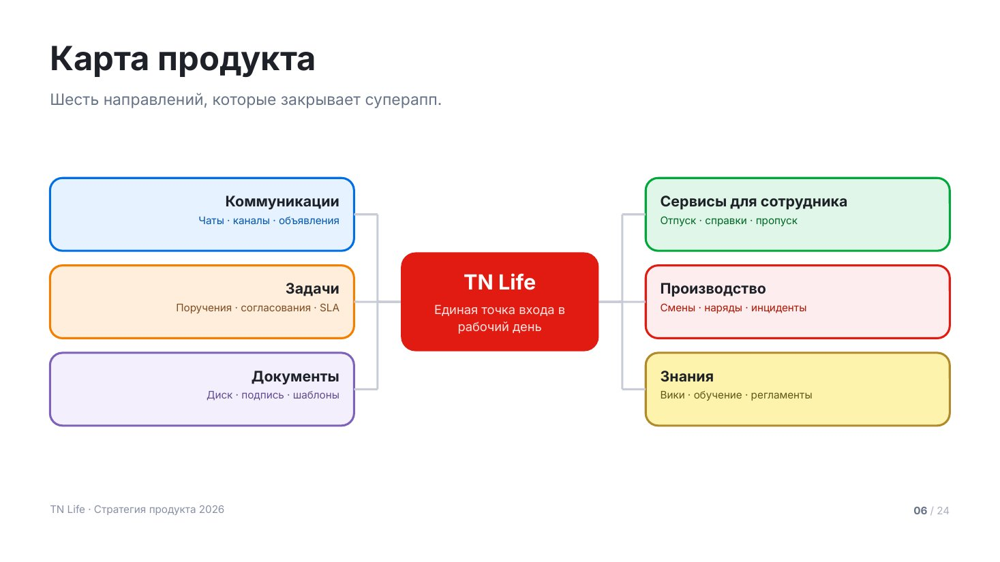
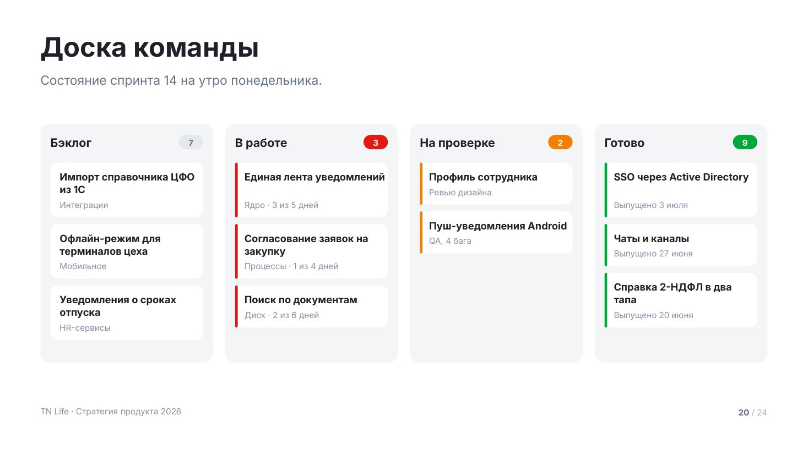
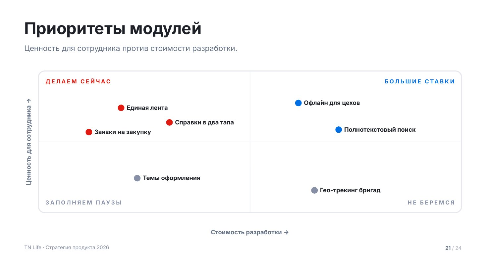
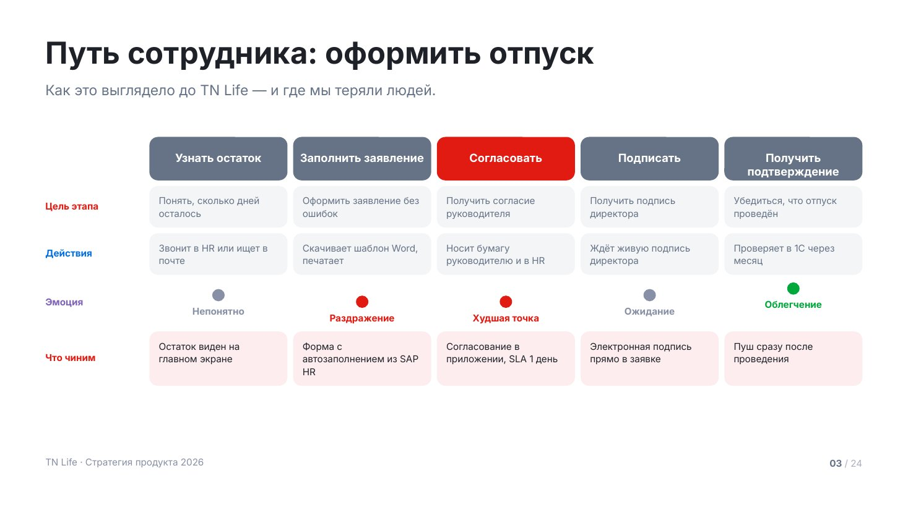

# Схемы

Макеты, где смысл несёт не текст, а связи между блоками: как устроен процесс,
кто с кем разговаривает, из чего собрана система, куда движется команда.

Все схемы рисуются фигурами PowerPoint, а не картинками: их можно открыть
и подвинуть блок. Соединители — примитив `TN.arrow()` пролога: он рисует
ортогональную ломаную с наконечником на последнем сегменте.

Схема нужна там, где отношения между элементами важнее самих элементов.
Если связей нет, а есть просто список — это `cards` или `features`.
Если связь одна и линейная — это `process`.

Сниппеты предполагают подключённый пролог — см. [README.md](README.md).

## `flowchart` — блок-схема процесса



Процесс с развилками: проверка, решение, два исхода. То, что в `process`
не помещается, потому что шаги там идут строго друг за другом.

Узел ставится в сетку: `col` — колонка слева направо, `row` — дорожка
(`0` — центральная, `-1` выше, `1` ниже). Связи описываются отдельно:
`{ from, to, label }`. Обратная связь («на доработку») рисуется через
`via: 'top'` или `'bottom'` — она обходит схему по верху или по низу.

До 10 узлов и 4 колонок: дальше схему не читают с проекции, её надо резать
на два слайда.

| Поле | Значение |
|---|---|
| `title` | заголовок слайда |
| `lead` | лид: какой процесс на схеме |
| `cols` | число колонок, по умолчанию по максимальному `col` |
| `nodes[].id` | идентификатор для связей |
| `nodes[].col` / `.row` | место в сетке |
| `nodes[].kind` | `step` (по умолчанию), `start`, `end`, `decision`, `note` |
| `nodes[].title` / `.text` | название узла и пояснение |
| `nodes[].tone` | свой акцент |
| `links[]` | `{ from, to, label, via, dash }` |

<details><summary>Сниппет</summary>

```js
function flowchart(p, d) {
  const s = p.addSlide();
  s.background = { color: TN.hex(C.bg) };
  const y0 = TN.header(s, d);
  const bottom = TN.contentBottom();

  const nodes = d.nodes;
  const cols = d.cols || Math.max(...nodes.map((n) => n.col)) + 1;
  const lanes = [...new Set(nodes.map((n) => n.row || 0))].sort((a, b) => a - b);
  const colW = CW / cols;
  const nw = Math.round(colW - 48);
  const dia = 184;                                  // сторона ромба
  const pd = 24;                                    // поля внутри узла
  const band = Math.min(260, Math.max(200, Math.floor((bottom - y0) / lanes.length)));
  const top = TN.place(y0, bottom, band * lanes.length, 0.4);
  const cx = (col) => MX + (col + 0.5) * colW;
  const cy = (row) => top + (lanes.indexOf(row || 0) + 0.5) * band;

  // сначала считаем рамки всех узлов — связи рисуются по ним
  const box = {};
  for (const n of nodes) {
    const dec = n.kind === 'decision';
    const iw = (dec ? dia : nw) - (dec ? 56 : pd * 2);
    const tH = TN.blockH(n.title, iw, T.small, true, 1.25);
    const xH = n.text ? TN.blockH(n.text, iw, T.caption, false, 1.35) + 8 : 0;
    const h = dec ? dia : Math.max(104, tH + xH + pd * 2);
    const w = dec ? dia : nw;
    box[n.id] = { x: cx(n.col) - w / 2, y: cy(n.row) - h / 2, w, h, cx: cx(n.col), cy: cy(n.row), n };
  }

  (d.links || []).forEach((lk) => {
    const a = box[lk.from], b = box[lk.to];
    if (!a || !b) return;
    let pts, lx, ly, align = 'center';
    if (lk.via === 'top' || lk.via === 'bottom') {
      const up = lk.via === 'top';
      const lane = up ? Math.min(a.y, b.y) - 56 : Math.max(a.y + a.h, b.y + b.h) + 56;
      pts = [[a.cx, up ? a.y : a.y + a.h], [a.cx, lane], [b.cx, lane], [b.cx, up ? b.y : b.y + b.h]];
      lx = (a.cx + b.cx) / 2 - 140; ly = lane - 40;
    } else if (Math.abs(a.cy - b.cy) < 4) {
      pts = [[a.x + a.w, a.cy], [b.x, b.cy]];
      lx = (a.x + a.w + b.x) / 2 - 140; ly = a.cy - 44;
    } else {
      const mid = Math.round((a.x + a.w + b.x) / 2);
      pts = [[a.x + a.w, a.cy], [mid, a.cy], [mid, b.cy], [b.x, b.cy]];
      lx = mid + 14; ly = (a.cy + b.cy) / 2 - 18; align = 'left';
    }
    TN.arrow(s, p, pts, { color: C.lineStrong, dash: lk.dash ? 'dash' : null });
    if (lk.label) TN.txt(s, lk.label, { x: lx, y: ly, w: 280, h: 30, size: T.caption, bold: true, color: C.muted, align });
  });

  for (const n of nodes) {
    const b = box[n.id];
    const a = TN.accent(0, n.tone);
    const term = n.kind === 'start' || n.kind === 'end';
    const dec = n.kind === 'decision';
    const note = n.kind === 'note';
    const on = term ? C.onAccent : C.ink;

    if (term) TN.rect(s, p, { x: b.x, y: b.y, w: b.w, h: b.h, r: Math.min(b.h / 2, 56), fill: a.solid });
    else if (dec) TN.diamond(s, p, { x: b.x, y: b.y, w: b.w, h: b.h, fill: C.bg, line: { color: a.solid, width: 3 } });
    else if (note) TN.rect(s, p, { x: b.x, y: b.y, w: b.w, h: b.h, r: TN.R.card, fill: a.tint, line: { color: a.solid, width: 2, dash: 'dash' } });
    else TN.rect(s, p, { x: b.x, y: b.y, w: b.w, h: b.h, r: TN.R.card, fill: C.surface, line: n.tone ? { color: a.solid, width: 3 } : null });

    const iw = b.w - (dec ? 56 : pd * 2);
    const tH = TN.blockH(n.title, iw, T.small, true, 1.25);
    const xH = n.text ? TN.blockH(n.text, iw, T.caption, false, 1.35) : 0;
    const ty = b.y + (b.h - tH - (xH ? xH + 8 : 0)) / 2;
    TN.txt(s, n.title, { x: b.x + (b.w - iw) / 2, y: ty, w: iw, h: tH + 6, size: T.small, bold: true, lh: 1.25,
      color: on, align: dec || term ? 'center' : 'left' });
    if (n.text) TN.txt(s, n.text, { x: b.x + (b.w - iw) / 2, y: ty + tH + 8, w: iw, h: xH + 6, size: T.caption, lh: 1.35,
      color: term ? C.onAccentDim : C.muted, align: dec || term ? 'center' : 'left' });
  }
  chrome(s, p);
}
```
</details>

Пример вызова:

```js
flowchart(p, {
    title: 'Схема процесса',
    lead: 'Согласование заявки на закупку в TN Life.',
    cols: 5,
    nodes: [
      { id: 'start', col: 0, kind: 'start', title: 'Заявка создана', text: 'Сотрудник в приложении' },
      { id: 'check', col: 1, title: 'Автопроверка данных', text: 'Лимиты, ЦФО, обязательные поля' },
      { id: 'full', col: 2, kind: 'decision', title: 'Данные полные?' },
      { id: 'back', col: 1, row: -1, kind: 'note', title: 'Возврат автору', text: 'Пуш с перечнем ошибок' },
      { id: 'sum', col: 3, kind: 'decision', title: 'Сумма > 500 тыс. ₽?' },
      { id: 'boss', col: 4, row: -1, title: 'Согласование руководителем', text: 'SLA — один рабочий день', tone: 'red' },
      { id: 'auto', col: 4, row: 1, title: 'Автосогласование', text: 'Мгновенно, без людей' },
    ],
    links: [
      { from: 'start', to: 'check' },
      { from: 'check', to: 'full' },
      { from: 'full', to: 'back', label: 'нет' },
      { from: 'back', to: 'check', label: 'доработка', via: 'top' },
      { from: 'full', to: 'sum', label: 'да' },
      { from: 'sum', to: 'boss', label: 'да' },
      { from: 'sum', to: 'auto', label: 'нет' },
    ],
  });
```

## `sequence` — диаграмма последовательности



Что происходит между системами и людьми по шагам во времени. Нужна, когда
вопрос не «из чего состоит», а «в каком порядке и кто кому отвечает».

Участники стоят сверху, время идёт вниз. Сообщение — стрелка между дорожками:
сплошная для вызова, `dash: true` для ответа. `from === to` рисует петлю —
это работа внутри одного участника.

До 6 участников и 12 сообщений.

| Поле | Значение |
|---|---|
| `title` | заголовок слайда |
| `lead` | лид: какой сценарий разобран |
| `actors[]` | `{ title, tone }`, слева направо |
| `messages[]` | `{ from, to, label, dash, tone }`, сверху вниз |

<details><summary>Сниппет</summary>

```js
function sequence(p, d) {
  const s = p.addSlide();
  s.background = { color: TN.hex(C.bg) };
  const y0 = TN.header(s, d);
  const bottom = TN.contentBottom();

  const actors = d.actors.slice(0, 6);
  const msgs = d.messages.slice(0, 12);
  const laneW = CW / actors.length;
  const lx = (i) => MX + (i + 0.5) * laneW;
  const chipH = 56;
  const step = Math.min(78, Math.floor((bottom - y0 - chipH - 70) / msgs.length));
  const need = chipH + 40 + step * msgs.length;
  const top = TN.place(y0, bottom, need, 0.18);
  const lifeTop = top + chipH;
  const lifeBottom = top + need;

  actors.forEach((ac, i) => {
    const a = TN.accent(0, ac.tone);
    const w = Math.min(laneW - 24, 340);
    const x = lx(i) - w / 2;
    TN.rect(s, p, { x, y: top, w, h: chipH, r: TN.R.tile, fill: ac.tone ? a.solid : C.deepSoft });
    TN.txt(s, ac.title, { x: x + 12, y: top + (chipH - 28) / 2, w: w - 24, h: 30, size: T.caption, bold: true,
      color: ac.tone ? C.onAccent : C.onDeep, align: 'center' });
    s.addShape(p.ShapeType.line, { x: px(lx(i)), y: px(lifeTop + 12), w: 0, h: px(lifeBottom - lifeTop - 12),
      line: { color: TN.hex(C.lineStrong), width: 1, dashType: 'dash' } });
  });

  msgs.forEach((m, i) => {
    const y = lifeTop + 40 + i * step;
    const a = TN.accent(0, m.tone);
    const col = m.tone ? a.solid : C.ink;
    if (m.from === m.to) {                       // работа внутри участника
      const x = lx(m.from), w = 90;
      TN.arrow(s, p, [[x, y], [x + w, y], [x + w, y + 26], [x, y + 26]], { color: col });
      TN.txt(s, m.label, { x: x + w + 16, y: y - 4, w: laneW, h: 34, size: T.caption, bold: true, color: col });
      return;
    }
    const x1 = lx(m.from), x2 = lx(m.to);
    TN.arrow(s, p, [[x1, y], [x2, y]], { color: col, dash: m.dash ? 'dash' : null });
    const left = Math.min(x1, x2), w = Math.abs(x2 - x1);
    TN.txt(s, m.label, { x: left, y: y - 36, w, h: 32, size: T.caption, bold: true, color: col, align: 'center' });
  });
  chrome(s, p);
}
```
</details>

Пример вызова:

```js
sequence(p, {
    title: 'Что происходит при отправке заявки',
    lead: 'Обмен между приложением, шлюзом и учётными системами.',
    actors: [
      { title: 'Сотрудник' },
      { title: 'TN Life · мобильное', tone: 'red' },
      { title: 'API-шлюз' },
      { title: 'Сервис заявок' },
      { title: '1С: Закупки' },
    ],
    messages: [
      { from: 0, to: 1, label: 'Заполняет форму' },
      { from: 1, to: 2, label: 'POST /requests', tone: 'red' },
      { from: 2, to: 3, label: 'createRequest()' },
      { from: 3, to: 4, label: 'GET /limits' },
      { from: 4, to: 3, label: 'Лимит и бюджет ЦФО', dash: true },
      { from: 3, to: 3, label: 'Валидация и расчёт маршрута' },
      { from: 3, to: 2, label: '201 Created', dash: true },
      { from: 2, to: 1, label: 'Статус «в работе»', dash: true },
      { from: 1, to: 0, label: 'Пуш «Заявка в работе»', tone: 'red' },
    ],
  });
```

## `architecture` — устройство системы



Из чего собрана платформа и с чем она разговаривает. Слева — кто пользуется,
в центре — что внутри контура, справа — внешние системы. Контур обведён
пунктиром: видно, за что отвечаем мы, а за что нет.

Это уровень контейнеров: приложения, сервисы, хранилища — не классы и не
серверы. Если внутри больше шести блоков, укрупняй.

| Поле | Значение |
|---|---|
| `title` | заголовок слайда |
| `lead` | лид |
| `actors[]` | `{ title, text }` — кто пользуется |
| `system.title` | название контура |
| `system.items[]` | `{ title, text, tone, wide }` — контейнеры внутри |
| `external[]` | `{ title, text, tone }` — внешние системы |

<details><summary>Сниппет</summary>

```js
function architecture(p, d) {
  const s = p.addSlide();
  s.background = { color: TN.hex(C.bg) };
  const y0 = TN.header(s, d);
  const bottom = TN.contentBottom();

  const sideW = 300, arrowW = 72, pd = 32, gap = 20;
  const midX = MX + sideW + arrowW;
  const midW = CW - (sideW + arrowW) * 2;

  const items = d.system.items.slice(0, 6);
  const rows = [];                             // раскладка контура: пары или широкие
  for (let i = 0; i < items.length; i++) {
    if (items[i].wide) rows.push([items[i]]);
    else if (rows.length && rows[rows.length - 1].length === 1 && !rows[rows.length - 1][0].wide) rows[rows.length - 1].push(items[i]);
    else rows.push([items[i]]);
  }
  const boxH = 128, rowStep = boxH + gap;
  const midH = pd + 44 + rows.length * rowStep - gap + pd;
  const sideH = Math.max(d.actors.length, d.external.length) * 148;
  const top = TN.place(y0, bottom, Math.max(midH, sideH), 0.36);

  // контур системы
  TN.rect(s, p, { x: midX, y: top, w: midW, h: midH, r: TN.R.big, fill: C.bg, line: { color: C.accent, width: 3, dash: 'dash' } });
  TN.txt(s, String(d.system.title).toUpperCase(), { x: midX + pd, y: top + pd, w: midW - pd * 2, h: 30,
    size: T.eyebrow, bold: true, spacing: 2.4, color: C.accent, font: TN.MONO || TN.FONT });

  rows.forEach((row, ri) => {
    const bw = row.length === 1 ? midW - pd * 2 : (midW - pd * 2 - gap) / 2;
    row.forEach((it, ci) => {
      const a = TN.accent(0, it.tone);
      const x = midX + pd + ci * (bw + gap);
      const y = top + pd + 44 + ri * rowStep;
      const solid = it.tone === 'red' || it.fill === 'solid';
      TN.rect(s, p, { x, y, w: bw, h: boxH, r: TN.R.card, fill: solid ? a.solid : it.tone ? a.tint : C.surface });
      TN.txt(s, it.title, { x: x + 28, y: y + 24, w: bw - 56, h: 36, size: T.h4, bold: true, color: solid ? C.onAccent : C.ink });
      if (it.text) TN.txt(s, it.text, { x: x + 28, y: y + 62, w: bw - 56, h: 48, size: T.caption, lh: 1.35,
        color: solid ? C.onAccentDim : it.tone ? a.deep : C.muted });
    });
  });

  // боковые колонки
  const side = (list, x, dark) => {
    const step = Math.min(160, Math.floor(midH / Math.max(list.length, 1)));
    const h = Math.min(132, step - 16);
    const t = top + (midH - step * list.length + (step - h)) / 2;
    list.forEach((it, i) => {
      const a = TN.accent(0, it.tone);
      const y = t + i * step;
      TN.rect(s, p, { x, y, w: sideW, h, r: TN.R.card, fill: dark ? C.deepSoft : it.tone ? a.tint : C.surface });
      TN.txt(s, it.title, { x: x + 24, y: y + 22, w: sideW - 48, h: 34, size: T.h4, bold: true, color: dark ? C.onDeep : C.ink });
      if (it.text) TN.txt(s, it.text, { x: x + 24, y: y + 60, w: sideW - 48, h: 46, size: T.caption, lh: 1.35,
        color: dark ? C.onDeepDim : it.tone ? a.deep : C.muted });
    });
  };
  side(d.actors.slice(0, 3), MX, true);
  side(d.external.slice(0, 4), MX + CW - sideW, false);

  const mid = top + midH / 2;
  TN.arrow(s, p, [[MX + sideW + 16, mid], [midX - 16, mid]], { color: C.lineStrong });
  TN.arrow(s, p, [[midX + midW + 16, mid], [MX + CW - sideW - 16, mid]], { color: C.lineStrong });
  chrome(s, p);
}
```
</details>

Пример вызова:

```js
architecture(p, {
    title: 'Из чего состоит платформа',
    lead: 'Уровень контейнеров: приложения, сервисы и хранилища.',
    actors: [
      { title: 'Сотрудник', text: '12 000 человек, 40 площадок' },
      { title: 'HR-админ', text: 'Настройка справочников' },
    ],
    system: {
      title: 'Платформа TN Life',
      items: [
        { title: 'Мобильное приложение', text: 'iOS, Android · React Native', tone: 'red' },
        { title: 'Веб-кабинет', text: 'React, дизайн-система TN Life', tone: 'red' },
        { title: 'API-шлюз', text: 'Авторизация, маршрутизация, лимиты', tone: 'blue' },
        { title: 'Сервисы домена', text: 'Заявки, чаты, задачи, документы', tone: 'green' },
        { title: 'Хранилище', text: 'PostgreSQL · S3 · поисковый индекс', wide: true },
      ],
    },
    external: [
      { title: '1С: ERP', text: 'Закупки и бюджеты', tone: 'purple' },
      { title: 'SAP HR', text: 'Оргструктура, отпуска', tone: 'orange' },
      { title: 'MES заводов', text: 'Смены и наряды', tone: 'green' },
      { title: 'Active Directory', text: 'SSO и учётные записи' },
    ],
  });
```

## `map` — карта направлений



Продукт или тема в центре, направления — по сторонам. Нужна там, где надо
одним экраном показать охват: что вообще входит в платформу.

От 4 до 6 ветвей, поровну слева и справа. Ветвь — это направление, а не задача:
«Коммуникации», а не «починить пуши».

| Поле | Значение |
|---|---|
| `title` | заголовок слайда |
| `lead` | лид |
| `center.title` / `.text` | что в центре |
| `branches[]` | `{ title, text, tone }` — раскладываются слева и справа по очереди |

<details><summary>Сниппет</summary>

```js
function map(p, d) {
  const s = p.addSlide();
  s.background = { color: TN.hex(C.bg) };
  const y0 = TN.header(s, d);
  const bottom = TN.contentBottom();

  const items = d.branches.slice(0, 6);
  const half = Math.ceil(items.length / 2);
  const left = items.slice(0, half), right = items.slice(half);
  const n = Math.max(left.length, right.length);

  const coreW = 380, coreH = 190, gutter = 90;
  const bw = Math.floor((CW - coreW - gutter * 2) / 2);
  const bh = 140, step = bh + 28;
  const need = Math.max(coreH, n * step - 28);
  const top = TN.place(y0, bottom, need, 0.4);
  const midY = top + need / 2;
  const coreX = MX + bw + gutter, coreY = midY - coreH / 2;

  const column = (list, x, dir) => {
    const t = midY - (list.length * step - 28) / 2;
    list.forEach((it, i) => {
      const a = TN.accent(i * 2 + (dir > 0 ? 1 : 0), it.tone);
      const y = t + i * step;
      TN.rect(s, p, { x, y, w: bw, h: bh, r: TN.R.card, fill: a.tint, line: { color: a.solid, width: 2 } });
      TN.txt(s, it.title, { x: x + 28, y: y + 26, w: bw - 56, h: 36, size: T.h4, bold: true, align: dir > 0 ? 'left' : 'right' });
      if (it.text) TN.txt(s, it.text, { x: x + 28, y: y + 66, w: bw - 56, h: 46, size: T.caption, lh: 1.35, color: a.deep, align: dir > 0 ? 'left' : 'right' });
      // соединитель: из середины ветви к середине центра
      const from = dir > 0 ? x : x + bw;
      const to = dir > 0 ? coreX + coreW : coreX;
      const midX = (from + to) / 2;
      TN.arrow(s, p, [[from, y + bh / 2], [midX, y + bh / 2], [midX, midY], [to, midY]], { color: C.lineStrong, head: false });
    });
  };
  column(left, MX, -1);
  column(right, MX + CW - bw, 1);

  TN.rect(s, p, { x: coreX, y: coreY, w: coreW, h: coreH, r: TN.R.big, fill: C.accent });
  const tH = TN.blockH(d.center.title, coreW - 56, T.h3 + 6, true, 1.15);
  const xH = d.center.text ? TN.blockH(d.center.text, coreW - 56, T.small, false, 1.35) : 0;
  let cy = coreY + (coreH - tH - (xH ? xH + 12 : 0)) / 2;
  TN.txt(s, d.center.title, { x: coreX + 28, y: cy, w: coreW - 56, h: tH + 6, size: T.h3 + 6, bold: true, color: C.onAccent, align: 'center', lh: 1.15 });
  if (d.center.text) TN.txt(s, d.center.text, { x: coreX + 28, y: cy + tH + 12, w: coreW - 56, h: xH + 6, size: T.small, lh: 1.35, color: C.onAccentDim, align: 'center' });
  chrome(s, p);
}
```
</details>

Пример вызова:

```js
map(p, {
    title: 'Карта продукта',
    lead: 'Шесть направлений, которые закрывает суперапп.',
    center: { title: 'TN Life', text: 'Единая точка входа в рабочий день' },
    branches: [
      { title: 'Коммуникации', text: 'Чаты · каналы · объявления', tone: 'blue' },
      { title: 'Задачи', text: 'Поручения · согласования · SLA', tone: 'orange' },
      { title: 'Документы', text: 'Диск · подпись · шаблоны', tone: 'purple' },
      { title: 'Сервисы для сотрудника', text: 'Отпуск · справки · пропуск', tone: 'green' },
      { title: 'Производство', text: 'Смены · наряды · инциденты', tone: 'red' },
      { title: 'Знания', text: 'Вики · обучение · регламенты', tone: 'yellow' },
    ],
  });
```

## `board` — доска задач



Состояние работ по колонкам: бэклог, в работе, на проверке, готово. Нужна
на статусе команды, где вопрос «что сейчас движется», а не «что запланировано»
(для планов есть `timeline`).

Счётчик в шапке колонки — это число задач всего, а не только показанных.
Показывай по 3–4 карточки на колонку: доска на слайде — это срез, а не трекер.

| Поле | Значение |
|---|---|
| `title` | заголовок слайда |
| `lead` | лид: на какой момент срез |
| `columns[].title` | название колонки |
| `columns[].count` | счётчик в шапке |
| `columns[].tone` | акцент колонки |
| `columns[].cards[]` | `{ title, note }` |

<details><summary>Сниппет</summary>

```js
function board(p, d) {
  const s = p.addSlide();
  s.background = { color: TN.hex(C.bg) };
  const y0 = TN.header(s, d);
  const bottom = TN.contentBottom();

  const cols = d.columns.slice(0, 5);
  const gap = 28, pd = 24, headH = 76;
  const cw = Math.floor((CW - gap * (cols.length - 1)) / cols.length);
  const iw = cw - pd * 2 - 28;

  // высота колонки — по самой длинной пачке карточек
  let need = 0;
  for (const col of cols) {
    let h = headH + pd;
    for (const c of (col.cards || []).slice(0, 4)) {
      h += TN.blockH(c.title, iw, T.small, true, 1.25) + (c.note ? TN.blockH(c.note, iw, T.caption, false, 1.3) + 8 : 0) + 36 + 16;
    }
    need = Math.max(need, h + pd - 16);
  }
  const chH = TN.boxH(need, bottom - y0, { grow: 1.04 });
  const top = TN.place(y0, bottom, chH, 0.3);

  cols.forEach((col, i) => {
    const a = TN.accent(i, col.tone);
    const x = MX + i * (cw + gap);
    TN.rect(s, p, { x, y: top, w: cw, h: chH, r: TN.R.card, fill: C.surface });
    TN.txt(s, col.title, { x: x + pd, y: top + 26, w: cw - pd * 2 - 70, h: 36, size: T.h4, bold: true });
    if (col.count != null) TN.pill(s, p, { x: x + cw - pd - 58, y: top + 26, w: 58, h: 34, size: T.caption,
      fill: col.tone ? a.solid : C.line, color: col.tone ? C.onAccent : C.muted, text: String(col.count) });

    let cy = top + headH + pd - 8;
    (col.cards || []).slice(0, 4).forEach((c) => {
      const tH = TN.blockH(c.title, iw, T.small, true, 1.25);
      const nH = c.note ? TN.blockH(c.note, iw, T.caption, false, 1.3) : 0;
      const h = tH + (nH ? nH + 8 : 0) + 36;
      TN.rect(s, p, { x: x + pd, y: cy, w: cw - pd * 2, h, r: TN.R.tile, fill: C.bg });
      if (col.tone) TN.rect(s, p, { x: x + pd, y: cy, w: 6, h, r: 3, fill: a.solid });
      TN.txt(s, c.title, { x: x + pd + 22, y: cy + 18, w: iw, h: tH + 4, size: T.small, bold: true, lh: 1.25 });
      if (c.note) TN.txt(s, c.note, { x: x + pd + 22, y: cy + 18 + tH + 8, w: iw, h: nH + 4, size: T.caption, lh: 1.3, color: C.soft });
      cy += h + 16;
    });
  });
  chrome(s, p);
}
```
</details>

Пример вызова:

```js
board(p, {
    title: 'Доска команды',
    lead: 'Состояние спринта 14 на утро понедельника.',
    columns: [
      { title: 'Бэклог', count: 7, cards: [
        { title: 'Импорт справочника ЦФО из 1С', note: 'Интеграции' },
        { title: 'Офлайн-режим для терминалов цеха', note: 'Мобильное' },
        { title: 'Уведомления о сроках отпуска', note: 'HR-сервисы' }] },
      { title: 'В работе', count: 3, tone: 'red', cards: [
        { title: 'Единая лента уведомлений', note: 'Ядро · 3 из 5 дней' },
        { title: 'Согласование заявок на закупку', note: 'Процессы · 1 из 4 дней' },
        { title: 'Поиск по документам', note: 'Диск · 2 из 6 дней' }] },
      { title: 'На проверке', count: 2, tone: 'orange', cards: [
        { title: 'Профиль сотрудника', note: 'Ревью дизайна' },
        { title: 'Пуш-уведомления Android', note: 'QA, 4 бага' }] },
      { title: 'Готово', count: 9, tone: 'green', cards: [
        { title: 'SSO через Active Directory', note: 'Выпущено 3 июля' },
        { title: 'Чаты и каналы', note: 'Выпущено 27 июня' },
        { title: 'Справка 2-НДФЛ в два тапа', note: 'Выпущено 20 июня' }] },
    ],
  });
```

## `matrix` — матрица приоритетов



Два критерия, четыре квадранта, точки внутри. Так показывают выбор, когда
вариантов больше трёх и словами их не сравнить: ценность против стоимости,
срочность против важности, охват против риска.

Координаты — доли от 0 до 1 по каждой оси. Точность здесь не нужна: смысл
в том, в каком квадранте оказался пункт и кто его сосед.

| Поле | Значение |
|---|---|
| `title` | заголовок слайда |
| `lead` | лид: что по осям |
| `x` / `y` | `{ label }` — подписи осей |
| `quadrants` | `{ tl, tr, bl, br }` — названия квадрантов |
| `items[]` | `{ title, x, y, tone }`, координаты 0…1 |

<details><summary>Сниппет</summary>

```js
function matrix(p, d) {
  const s = p.addSlide();
  s.background = { color: TN.hex(C.bg) };
  const y0 = TN.header(s, d);
  const bottom = TN.contentBottom();

  const axisW = 56, axisH = 56;                 // место под подписи осей
  const fx = MX + axisW, fw = CW - axisW;
  const fh = Math.min(560, bottom - y0 - axisH);
  const fy = TN.place(y0, bottom - axisH, fh, 0.3);
  const q = d.quadrants || {};

  TN.rect(s, p, { x: fx, y: fy, w: fw, h: fh, r: TN.R.card, fill: C.bg, line: { color: C.line, width: 2 } });
  TN.hline(s, p, { x: fx, y: fy + fh / 2, w: fw, color: C.line, width: 1 });
  s.addShape(p.ShapeType.line, { x: px(fx + fw / 2), y: px(fy), w: 0, h: px(fh), line: { color: TN.hex(C.line), width: 1 } });

  const lab = (text, x, y, w, align, color) => text && TN.txt(s, String(text).toUpperCase(),
    { x, y, w, h: 28, size: T.eyebrow, bold: true, spacing: 2.4, color, align, font: TN.MONO || TN.FONT });
  lab(q.tl, fx + 28, fy + 26, fw / 2 - 56, 'left', C.accent);
  lab(q.tr, fx + fw / 2 + 28, fy + 26, fw / 2 - 56, 'right', TN.accent(1).solid);
  lab(q.bl, fx + 28, fy + fh - 54, fw / 2 - 56, 'left', C.soft);
  lab(q.br, fx + fw / 2 + 28, fy + fh - 54, fw / 2 - 56, 'right', C.soft);

  if (d.x) TN.txt(s, d.x.label + ' →', { x: fx, y: bottom - 34, w: fw, h: 32, size: T.small, bold: true, color: C.muted, align: 'center' });
  if (d.y) TN.txt(s, d.y.label + ' →', { x: MX - 174, y: fy + fh / 2 - 16, w: 380, h: 32, size: T.small, bold: true,
    color: C.muted, align: 'center', rotate: 270 });

  (d.items || []).slice(0, 10).forEach((it) => {
    const grey = it.tone === 'grey' || it.tone === 'muted';
    const col = grey ? C.soft : TN.accent(0, it.tone).solid;
    const cx = fx + 40 + it.x * (fw - 80);
    const cy = fy + fh - 40 - it.y * (fh - 80);
    TN.ellipse(s, p, { x: cx - 13, y: cy - 13, w: 26, h: 26, fill: col });
    TN.txt(s, it.title, { x: cx + 22, y: cy - 17, w: 420, h: 34, size: T.small, bold: true });
  });
  chrome(s, p);
}
```
</details>

Пример вызова:

```js
matrix(p, {
    title: 'Приоритеты модулей',
    lead: 'Ценность для сотрудника против стоимости разработки.',
    x: { label: 'Стоимость разработки' },
    y: { label: 'Ценность для сотрудника' },
    quadrants: { tl: 'Делаем сейчас', tr: 'Большие ставки', bl: 'Заполняем паузы', br: 'Не беремся' },
    items: [
      { title: 'Единая лента', x: 0.18, y: 0.78 },
      { title: 'Справки в два тапа', x: 0.3, y: 0.66 },
      { title: 'Заявки на закупку', x: 0.1, y: 0.58 },
      { title: 'Офлайн для цехов', x: 0.62, y: 0.82, tone: 'blue' },
      { title: 'Полнотекстовый поиск', x: 0.72, y: 0.6, tone: 'blue' },
      { title: 'Темы оформления', x: 0.22, y: 0.2, tone: 'grey' },
      { title: 'Гео-трекинг бригад', x: 0.66, y: 0.1, tone: 'grey' },
    ],
  });
```

## `journey` — путь пользователя



Сценарий по этапам и слоям: что человек делает, через что проходит, где ему
больно. Главный макет исследовательской части деки — он показывает проблему
не списком, а местом, где она возникает.

Этапы идут по колонкам, слои — по строкам. Слой `emotion` рисуется точками:
так сразу видно нижнюю точку сценария. Этап с `highlight: true` подсвечивается
акцентом — это и есть место, ради которого собрали слайд.

До 6 этапов и 6 слоёв.

| Поле | Значение |
|---|---|
| `title` | заголовок слайда |
| `lead` | лид: чей путь и когда |
| `stages[]` | `{ title, highlight }` |
| `layers[]` | `{ label, tone, cells[], kind }` — `kind: 'emotion'` рисует точки |
| `labelW` | ширина колонки названий слоёв, по умолчанию 220 |

<details><summary>Сниппет</summary>

```js
function journey(p, d) {
  const s = p.addSlide();
  s.background = { color: TN.hex(C.bg) };
  const y0 = TN.header(s, d);
  const bottom = TN.contentBottom();

  const stages = d.stages.slice(0, 6);
  const layers = d.layers.slice(0, 6);
  const labelW = d.labelW || 220;
  const gap = 12;
  const cw = Math.floor((CW - labelW - gap * (stages.length - 1)) / stages.length);
  const headH = Math.max(72, Math.round(Math.max(...stages.map((st) => TN.blockH(st.title, cw - 28, T.small, true, 1.2))) + 34));
  const cx = (i) => MX + labelW + i * (cw + gap);

  // высота строки — по самой длинной ячейке в ней
  const rowH = layers.map((l) => {
    if (l.kind === 'emotion') return 96;
    let h = 0;
    for (const c of l.cells) h = Math.max(h, TN.blockH(String(c || ''), cw - 40, T.caption, false, 1.35));
    return Math.round(h + 34);
  });
  const need = headH + rowH.reduce((a, b) => a + b, 0) + gap * layers.length;
  const top = TN.place(y0, bottom, need, 0.18);

  stages.forEach((st, i) => {
    const hi = !!st.highlight;
    TN.rect(s, p, { x: cx(i), y: top, w: cw, h: headH, r: TN.R.tile, fill: hi ? C.accent : C.deepSoft });
    TN.txt(s, st.title, { x: cx(i) + 14, y: top + (headH - 34) / 2, w: cw - 28, h: 36, size: T.small, bold: true,
      color: hi ? C.onAccent : C.onDeep, align: 'center', lh: 1.2 });
  });

  let y = top + headH + gap;
  layers.forEach((l, li) => {
    const a = TN.accent(li, l.tone);
    const h = rowH[li];
    TN.txt(s, l.label, { x: MX, y: y + (h - 30) / 2, w: labelW - 24, h: 32, size: T.caption, bold: true, color: a.solid });

    l.cells.slice(0, stages.length).forEach((c, i) => {
      if (l.kind === 'emotion') {
        const v = c && typeof c === 'object' ? c : { label: c, level: 0 };
        const tone = v.tone || (v.level > 0 ? 'green' : v.level < 0 ? 'red' : null);
        const col = tone ? TN.accent(0, tone).solid : C.soft;
        const dy = y + 18 - v.level * 14;
        TN.ellipse(s, p, { x: cx(i) + cw / 2 - 13, y: dy, w: 26, h: 26, fill: col });
        if (v.label) TN.txt(s, v.label, { x: cx(i), y: dy + 34, w: cw, h: 30, size: T.caption, bold: true, color: col, align: 'center' });
        return;
      }
      TN.rect(s, p, { x: cx(i), y, w: cw, h, r: TN.R.tile, fill: l.tone === 'red' ? C.accentTint : C.surface });
      TN.txt(s, String(c || ''), { x: cx(i) + 20, y: y + 16, w: cw - 40, h: h - 24, size: T.caption, lh: 1.35,
        color: l.tone === 'red' ? C.ink : C.muted });
    });
    y += h + gap;
  });
  chrome(s, p);
}
```
</details>

Пример вызова:

```js
journey(p, {
    title: 'Путь сотрудника: оформить отпуск',
    lead: 'Как это выглядело до TN Life — и где мы теряли людей.',
    stages: [
      { title: 'Узнать остаток' },
      { title: 'Заполнить заявление' },
      { title: 'Согласовать', highlight: true },
      { title: 'Подписать' },
      { title: 'Получить подтверждение' },
    ],
    layers: [
      { label: 'Цель этапа', cells: ['Понять, сколько дней осталось', 'Оформить заявление без ошибок', 'Получить согласие руководителя', 'Получить подпись директора', 'Убедиться, что отпуск проведён'] },
      { label: 'Действия', tone: 'blue', cells: ['Звонит в HR или ищет в почте', 'Скачивает шаблон Word, печатает', 'Носит бумагу руководителю и в HR', 'Ждёт живую подпись директора', 'Проверяет в 1С через месяц'] },
      { label: 'Эмоция', kind: 'emotion', tone: 'purple', cells: [
        { label: 'Непонятно', level: 0 },
        { label: 'Раздражение', level: -1, tone: 'red' },
        { label: 'Худшая точка', level: -1, tone: 'red' },
        { label: 'Ожидание', level: 0 },
        { label: 'Облегчение', level: 1, tone: 'green' }] },
      { label: 'Что чиним', tone: 'red', cells: ['Остаток виден на главном экране', 'Форма с автозаполнением из SAP HR', 'Согласование в приложении, SLA 1 день', 'Электронная подпись прямо в заявке', 'Пуш сразу после проведения'] },
    ],
  });
```
