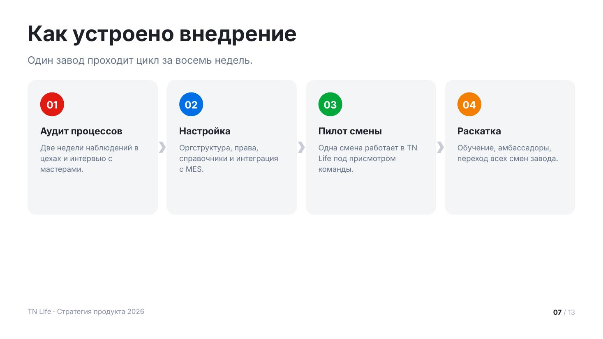
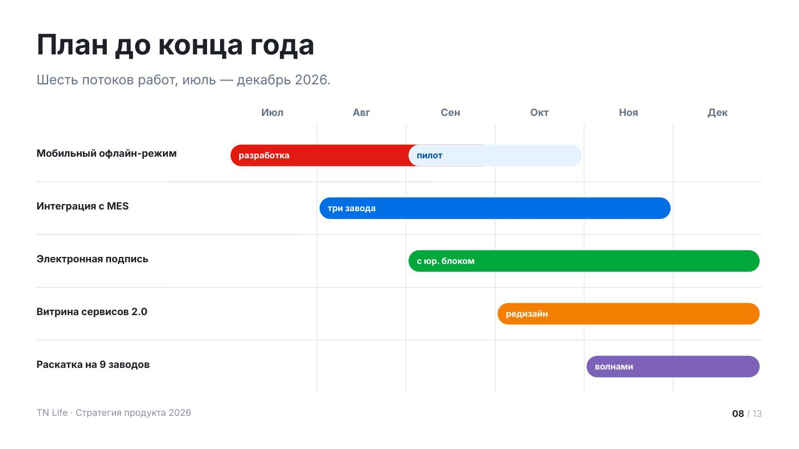
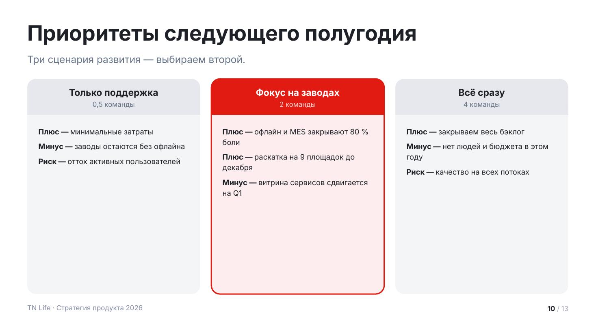

# Процессы и сравнения

Макеты про порядок, время и выбор.

Сниппеты предполагают подключённый пролог — см. [README.md](README.md).

## `process` — этапы процесса



Последовательные шаги: как устроено внедрение, как проходит сделка, что будет
дальше. Между карточками — шевроны, они показывают направление.

До 6 шагов. Если шагов больше — сгруппируй их в фазы. Если шаги не идут строго
друг за другом, это `cards`, а не процесс.

| Поле | Значение |
|---|---|
| `title` | заголовок слайда |
| `lead` | лид: сколько занимает весь цикл |
| `steps[].title` | название шага |
| `steps[].text` | что происходит, 1–3 строки |
| `steps[].tone` | свой акцент |
| `tone` | `light` — серый фон |

<details><summary>Сниппет</summary>

```js
function process(p, d) {
  const s = p.addSlide();
  s.background = { color: TN.hex(d.tone === 'light' ? C.surface : C.bg) };
  const y0 = TN.header(s, d);

  const steps = d.steps.slice(0, 6);
  const gap = 28, pd = 40;
  const cw = Math.floor((CW - gap * (steps.length - 1)) / steps.length);
  const avail = TN.contentBottom() - y0;

  let need = 0;
  for (const it of steps) {
    const tH = TN.blockH(it.title, cw - pd * 2, T.h4, true, 1.15);
    const xH = it.text ? TN.blockH(it.text, cw - pd * 2, T.small, false, 1.42) + 16 : 0;
    need = Math.max(need, pd * 2 + 106 + tH + xH);
  }
  const chH = Math.min(avail, Math.max(need, Math.round(avail * 0.62)));

  steps.forEach((it, i) => {
    const a = TN.accent(i, it.tone);
    const x = MX + i * (cw + gap);
    TN.rect(s, p, { x, y: y0, w: cw, h: chH, r: 28, fill: C.surface });
    TN.ellipse(s, p, { x: x + pd, y: y0 + pd, w: 76, h: 76, fill: a.solid });
    TN.txt(s, TN.pad2(i + 1), { x: x + pd, y: y0 + pd + 18, w: 76, h: 44, size: 32, bold: true, color: C.onAccent, align: 'center' });

    let cy = y0 + pd + 106;
    const tH = TN.blockH(it.title, cw - pd * 2, T.h4, true, 1.15);
    TN.txt(s, it.title, { x: x + pd, y: cy, w: cw - pd * 2, h: tH + 6, size: T.h4, bold: true, lh: 1.15 });
    cy += tH + 16;
    if (it.text) TN.txt(s, it.text, { x: x + pd, y: cy, w: cw - pd * 2, h: Math.max(30, y0 + chH - pd - cy), size: T.small, color: C.n60, lh: 1.42 });

    if (i < steps.length - 1) s.addShape(p.ShapeType.chevron, {
      x: px(x + cw + gap / 2 - 11), y: px(y0 + chH / 2 - 18), w: px(22), h: px(36),
      fill: { color: TN.hex(C.n30) }, line: TN.NOLINE,
    });
  });
  chrome(s, p);
}
```
</details>

Пример вызова:

```js
process(p, {
    title: 'Как устроено внедрение',
    lead: 'Один завод проходит цикл за восемь недель.',
    steps: [
      { title: 'Аудит процессов', text: 'Две недели наблюдений в цехах и интервью с мастерами.' },
      { title: 'Настройка', text: 'Оргструктура, права, справочники и интеграция с MES.' },
      { title: 'Пилот смены', text: 'Одна смена работает в TN Life под присмотром команды.' },
      { title: 'Раскатка', text: 'Обучение, амбассадоры, переход всех смен завода.' },
    ],
  });
```

## `timeline` — дорожная карта



Работы, растянутые по периодам. Слева названия потоков, сверху периоды,
внутри — полосы.

`from` и `to` — номера периодов, считая с 1, причём `to` не включается:
`{ from: 1, to: 3 }` покрывает первый и второй период. В одной строке может быть
несколько полос — так показывают смену фазы. `fill: 'tint'` делает полосу светлой:
этим отмечают то, что ещё не подтверждено.

До 8 строк и до 8 периодов.

| Поле | Значение |
|---|---|
| `title` | заголовок слайда |
| `lead` | лид: горизонт планирования |
| `periods` | подписи периодов: месяцы или кварталы |
| `rows[].title` | название потока работ |
| `rows[].bars[]` | `{ from, to, label, tone, fill }` |
| `labelW` | ширина колонки названий, по умолчанию 460 |

<details><summary>Сниппет</summary>

```js
function timeline(p, d) {
  const s = p.addSlide();
  s.background = { color: TN.hex(C.bg) };
  const y0 = TN.header(s, d);

  const labelW = d.labelW || 460;
  const gridX = MX + labelW;
  const colW = (CW - labelW) / d.periods.length;
  const gy = y0 + 56;
  const rowH = Math.max(70, Math.min(130, Math.floor((TN.contentBottom() - gy) / d.rows.length)));
  const gridBottom = gy + rowH * d.rows.length;

  d.periods.forEach((per, i) => {
    TN.txt(s, per, { x: gridX + i * colW, y: y0, w: colW, h: 36, size: T.small, bold: true, color: C.n60, align: 'center' });
    if (i) s.addShape(p.ShapeType.line, { x: px(gridX + i * colW), y: px(y0 + 44), w: 0, h: px(gridBottom - y0 - 44), line: { color: TN.hex(C.n20), width: 1 } });
  });

  d.rows.forEach((r, i) => {
    const y = gy + i * rowH;
    TN.txt(s, r.title, { x: MX, y: y + (rowH - 40) / 2, w: labelW - 24, h: 44, size: T.small, bold: true, lh: 1.2 });
    (r.bars || []).forEach((b, j) => {
      const a = TN.accent(i + j, b.tone);
      const from = Math.max(0, b.from - 1), to = Math.min(d.periods.length, b.to || b.from);
      const bx = gridX + from * colW + 6, bw = (to - from) * colW - 12;
      const bh = Math.min(52, rowH - 26);
      const tint = b.fill === 'tint';
      TN.rect(s, p, { x: bx, y: y + (rowH - bh) / 2, w: bw, h: bh, r: bh / 2, fill: tint ? a.tint : a.solid });
      if (b.label) TN.txt(s, b.label, { x: bx + 20, y: y + (rowH - bh) / 2 + (bh - 28) / 2, w: bw - 40, h: 30, size: 21, bold: true, color: tint ? a.deep : C.onAccent });
    });
    if (i < d.rows.length - 1) TN.hline(s, p, { x: MX, y: y + rowH, w: CW, width: 1 });
  });
  chrome(s, p);
}
```
</details>

Пример вызова:

```js
timeline(p, {
    title: 'План до конца года',
    lead: 'Шесть потоков работ, июль — декабрь 2026.',
    periods: ['Июл', 'Авг', 'Сен', 'Окт', 'Ноя', 'Дек'],
    rows: [
      { title: 'Мобильный офлайн-режим', bars: [{ from: 1, to: 3, label: 'разработка' }, { from: 3, to: 4, label: 'пилот', fill: 'tint' }] },
      { title: 'Интеграция с MES', bars: [{ from: 2, to: 5, label: 'три завода', tone: 'blue' }] },
      { title: 'Электронная подпись', bars: [{ from: 3, to: 6, label: 'с юр. блоком', tone: 'green' }] },
      { title: 'Витрина сервисов 2.0', bars: [{ from: 4, to: 7, label: 'редизайн', tone: 'orange' }] },
      { title: 'Раскатка на 9 заводов', bars: [{ from: 5, to: 7, label: 'волнами', tone: 'purple' }] },
    ],
  });
```

## `compare` — сравнение вариантов



Два–четыре варианта решения рядом. У каждого шапка с названием и подзаголовком,
внутри — список плюсов, минусов и рисков.

`highlight: true` выделяет рекомендуемый вариант: заливка акцентом в шапке и рамка.
Выделяй ровно один — иначе выбор не читается. Полезно давать пункты парами
«Плюс / Минус / Риск», чтобы колонки сравнивались построчно.

| Поле | Значение |
|---|---|
| `title` | заголовок слайда |
| `lead` | лид: что выбираем и почему |
| `columns[].title` | название варианта |
| `columns[].subtitle` | цена варианта: сроки, люди, бюджет |
| `columns[].items` | список `{ title, text }` |
| `columns[].tone` | свой акцент |
| `columns[].highlight` | `true` — рекомендуемый вариант |

<details><summary>Сниппет</summary>

```js
function compare(p, d) {
  const s = p.addSlide();
  s.background = { color: TN.hex(d.tone === 'light' ? C.surface : C.bg) };
  const y0 = TN.header(s, d);

  const cols = d.columns.slice(0, 4);
  const gap = 36;
  const cw = Math.floor((CW - gap * (cols.length - 1)) / cols.length);
  const chH = TN.contentBottom() - y0;

  cols.forEach((col, i) => {
    const a = TN.accent(i, col.tone);
    const x = MX + i * (cw + gap);
    const hi = !!col.highlight;
    TN.rect(s, p, { x, y: y0, w: cw, h: chH, r: 28, fill: hi ? a.tint : C.n15, line: hi ? { color: a.solid, width: 2 } : null });
    // шапка колонки: скруглённый прямоугольник + прямоугольник-«подбородок»
    TN.rect(s, p, { x, y: y0, w: cw, h: 116, r: 28, fill: hi ? a.solid : C.n20 });
    TN.rect(s, p, { x, y: y0 + 88, w: cw, h: 28, fill: hi ? a.solid : C.n20 });
    TN.txt(s, col.title, { x: x + 32, y: y0 + 24, w: cw - 64, h: 44, size: T.h4, bold: true, align: 'center', color: hi ? C.onAccent : C.ink });
    if (col.subtitle) TN.txt(s, col.subtitle, { x: x + 32, y: y0 + 68, w: cw - 64, h: 34, size: 22, align: 'center', color: hi ? C.onRedMeta : C.n60 });
    TN.bullets(s, col.items, { x: x + 36, y: y0 + 150, w: cw - 72, h: chH - 180, size: T.small, lh: 1.42, gap: 14, bullet: a.solid });
  });
  chrome(s, p);
}
```
</details>

Пример вызова:

```js
compare(p, {
    title: 'Приоритеты следующего полугодия',
    lead: 'Три сценария развития — выбираем второй.',
    columns: [
      { title: 'Только поддержка', subtitle: '0,5 команды', items: [
        { title: 'Плюс', text: 'минимальные затраты' },
        { title: 'Минус', text: 'заводы остаются без офлайна' },
        { title: 'Риск', text: 'отток активных пользователей' }] },
      { title: 'Фокус на заводах', subtitle: '2 команды', highlight: true, tone: 'red', items: [
        { title: 'Плюс', text: 'офлайн и MES закрывают 80 % боли' },
        { title: 'Плюс', text: 'раскатка на 9 площадок до декабря' },
        { title: 'Минус', text: 'витрина сервисов сдвигается на Q1' }] },
      { title: 'Всё сразу', subtitle: '4 команды', tone: 'blue', items: [
        { title: 'Плюс', text: 'закрываем весь бэклог' },
        { title: 'Минус', text: 'нет людей и бюджета в этом году' },
        { title: 'Риск', text: 'качество на всех потоках' }] },
    ],
  });
```
