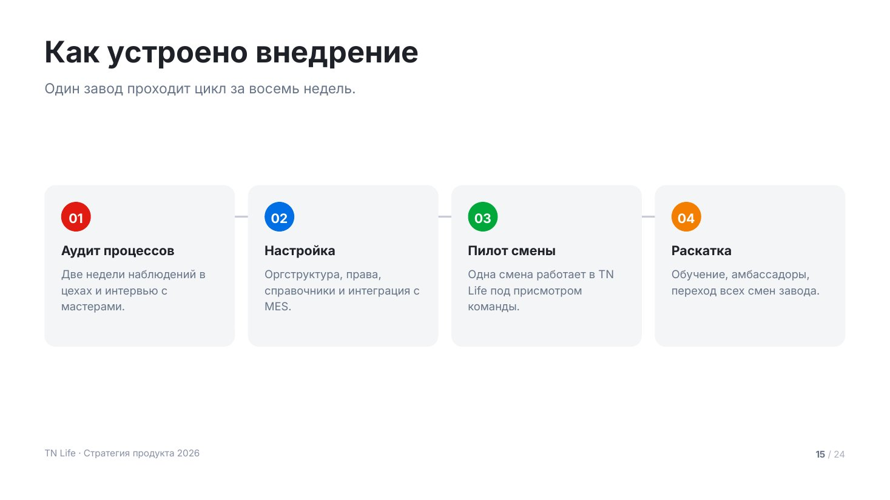
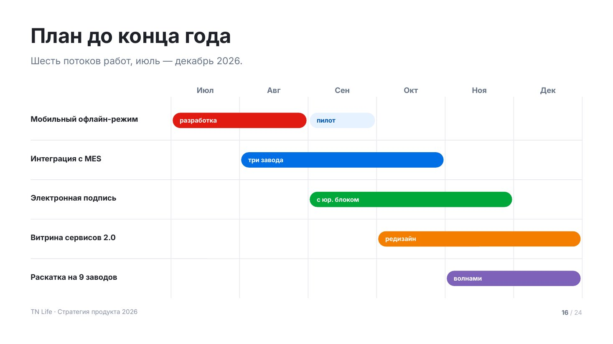
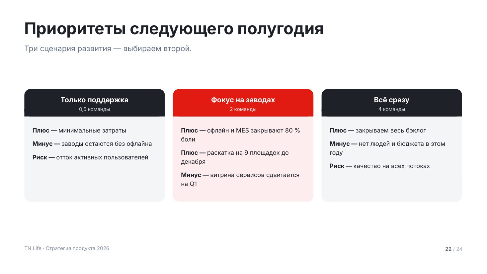
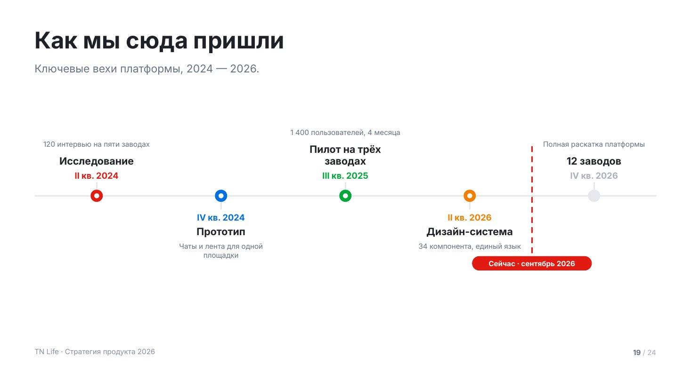

# Процессы и сравнения

Макеты про порядок, время и выбор.

Сниппеты предполагают подключённый пролог — см. [README.md](README.md).

## `process` — этапы процесса



Последовательные шаги: как устроено внедрение, как проходит сделка, что будет
дальше. Шаги связаны рельсом — тонкой линией на уровне номеров, она видна
в промежутках между карточками. Стрелок-глифов в системе нет: на проекции
они читаются как посторонний символ.

До 6 шагов. Если шагов больше — сгруппируй их в фазы. Если шаги не идут строго
друг за другом, это `cards`, а не процесс.

| Поле | Значение |
|---|---|
| `title` | заголовок слайда |
| `lead` | лид: сколько занимает весь цикл |
| `steps[].title` | название шага |
| `steps[].text` | что происходит, 1–3 строки |
| `steps[].tone` | свой акцент |
| `tone` | `light` — серый фон |

<details><summary>Сниппет</summary>

```js
function process(p, d) {
  const s = p.addSlide();
  const light = d.tone === 'light';
  s.background = { color: TN.hex(light ? C.surface : C.bg) };
  const y0 = TN.header(s, d);

  const steps = d.steps.slice(0, 6);
  const gap = 28, pd = 36, dot = 64;
  const cw = Math.floor((CW - gap * (steps.length - 1)) / steps.length), iw = cw - pd * 2;

  let need = 0;
  for (const it of steps) {
    const tH = TN.blockH(it.title, iw, T.h4, true, 1.2);
    const xH = it.text ? TN.blockH(it.text, iw, T.small, false, 1.45) + 14 : 0;
    need = Math.max(need, pd * 2 + dot + 24 + tH + xH);
  }
  const ch = TN.boxH(need, TN.contentBottom() - y0, { grow: 1.12 });
  const top = TN.place(y0, TN.contentBottom(), ch, 0.42);
  const dotY = top + pd;

  // рельс рисуется первым: карточки его перекрывают, в промежутках он виден
  TN.hline(s, p, { x: MX + pd + dot / 2, y: dotY + dot / 2, w: CW - (pd + dot / 2) * 2, color: C.lineStrong, width: 2 });

  steps.forEach((it, i) => {
    const a = TN.accent(i, it.tone);
    const x = MX + i * (cw + gap);
    TN.rect(s, p, { x, y: top, w: cw, h: ch, r: TN.R.card, fill: light ? C.bg : C.surface });
    TN.ellipse(s, p, { x: x + pd, y: dotY, w: dot, h: dot, fill: a.solid });
    TN.txt(s, TN.pad2(i + 1), { x: x + pd, y: dotY + (dot - 30) / 2, w: dot, h: 34, size: T.h4, bold: true, color: C.onAccent, align: 'center' });

    let cy = dotY + dot + 24;
    const tH = TN.blockH(it.title, iw, T.h4, true, 1.2);
    TN.txt(s, it.title, { x: x + pd, y: cy, w: iw, h: tH + 6, size: T.h4, bold: true, lh: 1.2 });
    cy += tH + 14;
    if (it.text) TN.txt(s, it.text, { x: x + pd, y: cy, w: iw, h: Math.max(30, top + ch - pd - cy), size: T.small, color: C.muted, lh: 1.45 });
  });
  chrome(s, p);
}
```
</details>

Пример вызова:

```js
process(p, {
    title: 'Как устроено внедрение',
    lead: 'Один завод проходит цикл за восемь недель.',
    steps: [
      { title: 'Аудит процессов', text: 'Две недели наблюдений в цехах и интервью с мастерами.' },
      { title: 'Настройка', text: 'Оргструктура, права, справочники и интеграция с MES.' },
      { title: 'Пилот смены', text: 'Одна смена работает в TN Life под присмотром команды.' },
      { title: 'Раскатка', text: 'Обучение, амбассадоры, переход всех смен завода.' },
    ],
  });
```

## `timeline` — дорожная карта



Работы, растянутые по периодам. Слева названия потоков, сверху периоды,
внутри — полосы. Колонки размечены вертикальными линейками по обеим границам,
поэтому полоса всегда читается под своими месяцами.

`from` и `to` — номера периодов, считая с 1, **включительно**: `{ from: 1, to: 2 }`
покрывает первый и второй период, `{ from: 3 }` — только третий. В одной строке может
быть несколько полос — так показывают смену фазы. `fill: 'tint'` делает полосу светлой:
этим отмечают то, что ещё не подтверждено.

До 8 строк и до 8 периодов.

| Поле | Значение |
|---|---|
| `title` | заголовок слайда |
| `lead` | лид: горизонт планирования |
| `periods` | подписи периодов: месяцы или кварталы |
| `rows[].title` | название потока работ |
| `rows[].bars[]` | `{ from, to, label, tone, fill }` |
| `labelW` | ширина колонки названий, по умолчанию 440 |

<details><summary>Сниппет</summary>

```js
function timeline(p, d) {
  const s = p.addSlide();
  s.background = { color: TN.hex(C.bg) };
  const y0 = TN.header(s, d);

  const labelW = d.labelW || 440;
  const gridX = MX + labelW, colW = (CW - labelW) / d.periods.length;
  const headH = 52;
  const bottom = TN.contentBottom();
  const rowH = Math.max(72, Math.min(132, Math.floor((bottom - y0 - headH) / d.rows.length)));
  const gridH = rowH * d.rows.length;
  const top = TN.place(y0, bottom, headH + gridH, 0.22);
  const gy = top + headH;

  d.periods.forEach((per, i) => {
    TN.txt(s, per, { x: gridX + i * colW, y: top + 4, w: colW, h: 32, size: T.small, bold: true, color: C.muted, align: 'center' });
  });
  for (let i = 0; i <= d.periods.length; i++) {
    s.addShape(p.ShapeType.line, { x: px(gridX + i * colW), y: px(gy - 12), w: 0, h: px(gridH + 12), line: { color: TN.hex(C.line), width: 1 } });
  }

  d.rows.forEach((r, i) => {
    const y = gy + i * rowH;
    if (i) TN.hline(s, p, { x: MX, y, w: CW, color: C.line, width: 1 });
    TN.txt(s, r.title, { x: MX, y: y + (rowH - 38) / 2, w: labelW - 32, h: 40, size: T.small, bold: true, lh: 1.2 });

    (r.bars || []).forEach((b, j) => {
      const a = TN.accent(i + j, b.tone);
      const from = Math.max(1, b.from), to = Math.min(d.periods.length, b.to || b.from);
      const bx = gridX + (from - 1) * colW + 5, bw = (to - from + 1) * colW - 10;
      const bh = Math.min(48, rowH - 28);
      const tint = b.fill === 'tint';
      TN.rect(s, p, { x: bx, y: y + (rowH - bh) / 2, w: bw, h: bh, r: bh / 2, fill: tint ? a.tint : a.solid });
      if (b.label) TN.txt(s, b.label, { x: bx + 22, y: y + (rowH - bh) / 2 + (bh - 26) / 2, w: bw - 44, h: 28, size: T.caption, bold: true, color: tint ? a.deep : C.onAccent });
    });
  });
  chrome(s, p);
}
```
</details>

Пример вызова:

```js
timeline(p, {
    title: 'План до конца года',
    lead: 'Шесть потоков работ, июль — декабрь 2026.',
    periods: ['Июл', 'Авг', 'Сен', 'Окт', 'Ноя', 'Дек'],
    rows: [
      { title: 'Мобильный офлайн-режим', bars: [{ from: 1, to: 2, label: 'разработка' }, { from: 3, to: 3, label: 'пилот', fill: 'tint' }] },
      { title: 'Интеграция с MES', bars: [{ from: 2, to: 4, label: 'три завода', tone: 'blue' }] },
      { title: 'Электронная подпись', bars: [{ from: 3, to: 5, label: 'с юр. блоком', tone: 'green' }] },
      { title: 'Витрина сервисов 2.0', bars: [{ from: 4, to: 6, label: 'редизайн', tone: 'orange' }] },
      { title: 'Раскатка на 9 заводов', bars: [{ from: 5, to: 6, label: 'волнами', tone: 'purple' }] },
    ],
  });
```

## `compare` — сравнение вариантов



Два–четыре варианта решения рядом. У каждого шапка с названием и подзаголовком,
внутри — список плюсов, минусов и рисков. Высота колонок считается по самому
длинному списку: колонка заканчивается там, где заканчивается текст, а не внизу
слайда.

`highlight: true` выделяет рекомендуемый вариант: шапка заливается акцентом,
тело — светлым акцентным тоном. Выделяй ровно один — иначе выбор не читается.
Полезно давать пункты парами «Плюс / Минус / Риск», чтобы колонки сравнивались
построчно.

| Поле | Значение |
|---|---|
| `title` | заголовок слайда |
| `lead` | лид: что выбираем и почему |
| `columns[].title` | название варианта |
| `columns[].subtitle` | цена варианта: сроки, люди, бюджет |
| `columns[].items` | список `{ title, text }` |
| `columns[].tone` | свой акцент |
| `columns[].highlight` | `true` — рекомендуемый вариант |

<details><summary>Сниппет</summary>

```js
function compare(p, d) {
  const s = p.addSlide();
  const light = d.tone === 'light';
  s.background = { color: TN.hex(light ? C.surface : C.bg) };
  const y0 = TN.header(s, d);

  const cols = d.columns.slice(0, 4);
  const gap = 32, headH = 108, pd = 32, sp = 18;
  const cw = Math.floor((CW - gap * (cols.length - 1)) / cols.length), iw = cw - pd * 2;

  // высота колонки — по самому длинному списку
  let need = 0;
  for (const col of cols) {
    const h = col.items.reduce((acc, it) => acc +
      TN.blockH([it.title, it.text].filter(Boolean).join(' — '), iw - 40, T.small, false, 1.45), 0) + sp * (col.items.length - 1);
    need = Math.max(need, headH + 34 + h + pd);
  }
  const chH = TN.boxH(need, TN.contentBottom() - y0, { grow: 1.06 });
  const top = TN.place(y0, TN.contentBottom(), chH, 0.38);

  cols.forEach((col, i) => {
    const a = TN.accent(i, col.tone);
    const x = MX + i * (cw + gap);
    const hi = !!col.highlight;
    TN.rect(s, p, { x, y: top, w: cw, h: chH, r: TN.R.card, fill: hi ? a.tint : light ? C.bg : C.surface });
    // шапка: скруглённый прямоугольник плюс «подбородок», чтобы низ был прямым
    TN.rect(s, p, { x, y: top, w: cw, h: headH, r: TN.R.card, fill: hi ? a.solid : C.deep });
    TN.rect(s, p, { x, y: top + headH - 28, w: cw, h: 28, fill: hi ? a.solid : C.deep });

    TN.txt(s, col.title, { x: x + 28, y: top + 24, w: cw - 56, h: 40, size: T.h4, bold: true, align: 'center', color: hi ? C.onAccent : C.onDeep });
    if (col.subtitle) TN.txt(s, col.subtitle, { x: x + 28, y: top + 66, w: cw - 56, h: 30, size: T.caption, align: 'center', color: hi ? C.onAccentDim : C.onDeepDim });

    TN.bullets(s, col.items, { x: x + pd, y: top + headH + 34, w: iw, h: chH - headH - 34 - pd, size: T.small, lh: 1.45, gap: sp, bullet: a.solid });
  });
  chrome(s, p);
}
```
</details>

Пример вызова:

```js
compare(p, {
    title: 'Приоритеты следующего полугодия',
    lead: 'Три сценария развития — выбираем второй.',
    columns: [
      { title: 'Только поддержка', subtitle: '0,5 команды', items: [
        { title: 'Плюс', text: 'минимальные затраты' },
        { title: 'Минус', text: 'заводы остаются без офлайна' },
        { title: 'Риск', text: 'отток активных пользователей' }] },
      { title: 'Фокус на заводах', subtitle: '2 команды', highlight: true, tone: 'red', items: [
        { title: 'Плюс', text: 'офлайн и MES закрывают 80 % боли' },
        { title: 'Плюс', text: 'раскатка на 9 площадок до декабря' },
        { title: 'Минус', text: 'витрина сервисов сдвигается на Q1' }] },
      { title: 'Всё сразу', subtitle: '4 команды', tone: 'blue', items: [
        { title: 'Плюс', text: 'закрываем весь бэклог' },
        { title: 'Минус', text: 'нет людей и бюджета в этом году' },
        { title: 'Риск', text: 'качество на всех потоках' }] },
    ],
  });
```

## `milestones` — вехи



Путь, который уже пройден: с чего начали, что было дальше, где мы сейчас.
В отличие от `timeline`, здесь не длительности работ, а точки — события,
у каждого своя дата.

Подписи чередуются над и под осью, поэтому длинные названия не сталкиваются.
`now: N` ставит пунктирную отсечку «сейчас» после N-й вехи — до неё прошлое,
после неё план.

До 6 вех.

| Поле | Значение |
|---|---|
| `title` | заголовок слайда |
| `lead` | лид: горизонт |
| `items[].period` | дата или квартал |
| `items[].title` | что произошло |
| `items[].text` | одна строка подробностей |
| `items[].tone` | свой акцент |
| `now` | номер вехи, после которой отсечка «сейчас» |
| `nowLabel` | подпись отсечки |

<details><summary>Сниппет</summary>

```js
function milestones(p, d) {
  const s = p.addSlide();
  s.background = { color: TN.hex(C.bg) };
  const y0 = TN.header(s, d);
  const bottom = TN.contentBottom();

  const items = d.items.slice(0, 6);
  const step = CW / items.length;
  const iw = Math.min(step - 32, 340);
  const armH = 118;                                  // высота подписи над и под осью
  const nowH = d.now != null ? 56 : 0;               // дорожка под отсечку «сейчас»
  const need = armH * 2 + 40 + nowH;
  const axisY = TN.place(y0, bottom, need, 0.42) + armH + 20;

  TN.hline(s, p, { x: MX, y: axisY, w: CW, color: C.line, width: 2 });

  items.forEach((it, i) => {
    const a = TN.accent(i, it.tone);
    const cx = MX + (i + 0.5) * step;
    const up = i % 2 === 0;
    const future = d.now != null && i >= d.now;
    const col = future ? C.faint : a.solid;

    s.addShape(p.ShapeType.line, { x: px(cx), y: px(up ? axisY - 38 : axisY), w: 0, h: px(38),
      line: { color: TN.hex(C.line), width: 2 } });
    TN.ellipse(s, p, { x: cx - 17, y: axisY - 17, w: 34, h: 34, fill: C.bg });
    TN.ellipse(s, p, { x: cx - 17, y: axisY - 17, w: 34, h: 34, fill: future ? C.line : col });
    if (!future) TN.ellipse(s, p, { x: cx - 7, y: axisY - 7, w: 14, h: 14, fill: C.bg });

    const px0 = cx - iw / 2;
    const py = up ? axisY - 38 - armH : axisY + 44;
    TN.txt(s, it.period, { x: px0, y: up ? py + armH - 34 : py, w: iw, h: 32, size: T.small, bold: true, color: col, align: 'center' });
    const tH = TN.blockH(it.title, iw, T.h4, true, 1.2);
    const ty = up ? py + armH - 34 - tH - 8 : py + 38;
    TN.txt(s, it.title, { x: px0, y: ty, w: iw, h: tH + 6, size: T.h4, bold: true, align: 'center', lh: 1.2 });
    if (it.text) TN.txt(s, it.text, { x: px0, y: up ? ty - 44 : ty + tH + 10, w: iw, h: 42, size: T.caption, lh: 1.3,
      color: C.muted, align: 'center' });
  });

  if (d.now != null && d.now < items.length) {
    const nx = MX + d.now * step;
    s.addShape(p.ShapeType.line, { x: px(nx), y: px(axisY - armH - 20), w: 0, h: px(armH * 2 + 40 + nowH),
      line: { color: TN.hex(C.accent), width: 2, dashType: 'dash' } });
    const label = d.nowLabel || 'Сейчас';
    const w = 60 + label.length * T.caption * 0.62;
    // подпись уводим под нижнюю дорожку: там она ни на что не наедет
    TN.pill(s, p, { x: Math.min(MX + CW - w, Math.max(MX, nx - w / 2)), y: axisY + armH + 50, w, h: 40,
      size: T.caption, fill: C.accent, color: C.onAccent, text: label });
  }
  chrome(s, p);
}
```
</details>

Пример вызова:

```js
milestones(p, {
    title: 'Как мы сюда пришли',
    lead: 'Ключевые вехи платформы, 2024 — 2026.',
    now: 4,
    nowLabel: 'Сейчас · сентябрь 2026',
    items: [
      { period: 'II кв. 2024', title: 'Исследование', text: '120 интервью на пяти заводах' },
      { period: 'IV кв. 2024', title: 'Прототип', text: 'Чаты и лента для одной площадки' },
      { period: 'III кв. 2025', title: 'Пилот на трёх заводах', text: '1 400 пользователей, 4 месяца' },
      { period: 'II кв. 2026', title: 'Дизайн-система', text: '34 компонента, единый язык' },
      { period: 'IV кв. 2026', title: '12 заводов', text: 'Полная раскатка платформы' },
    ],
  });
```
