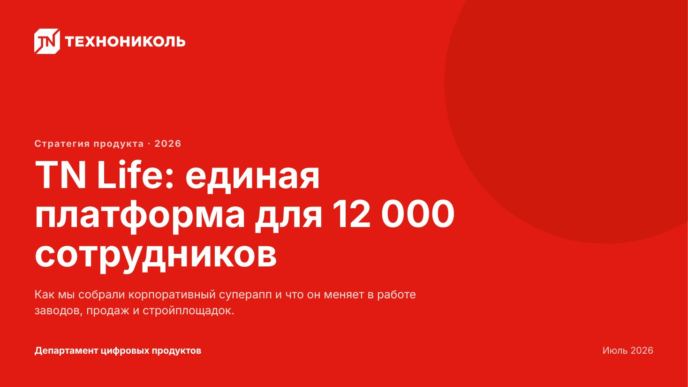
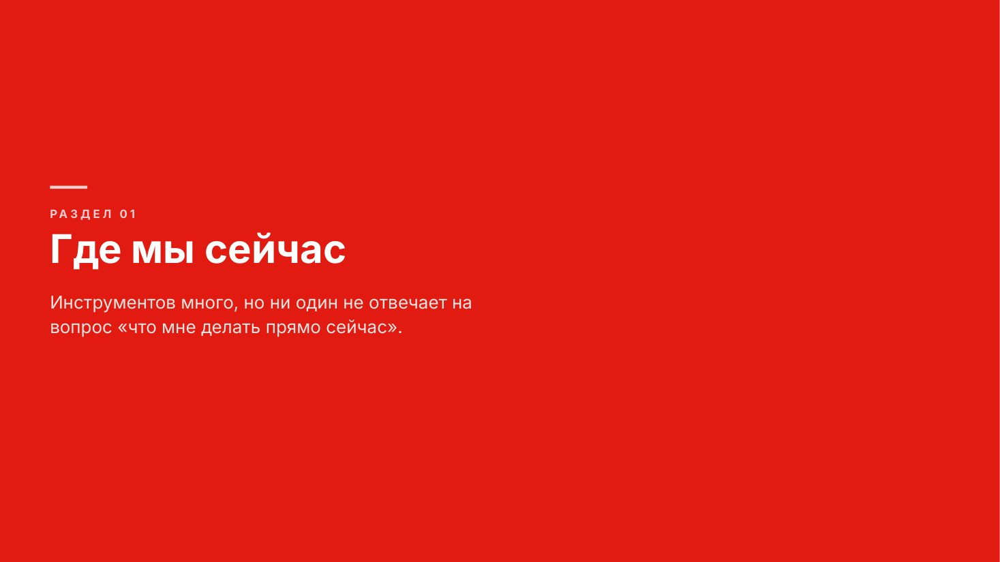
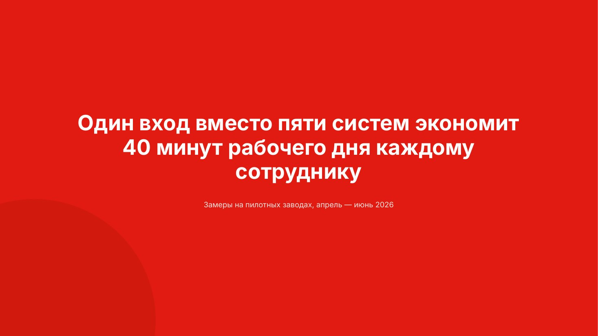
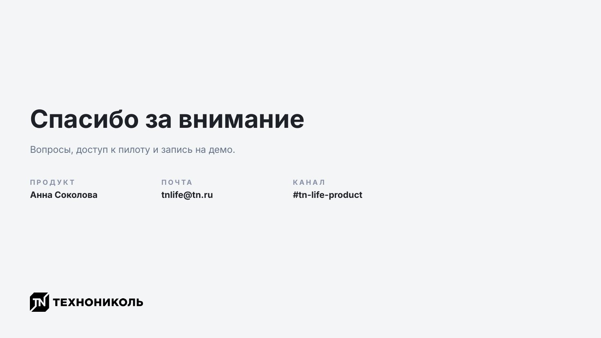

# Открытие, разделители, финал

Макеты без колонтитула и без номера страницы. Они держат ритм деки: с чего начали,
где сменился раздел, чем закончили.

Сниппеты предполагают подключённый пролог — см. [README.md](README.md).

## `title` — титульный слайд



Первый слайд деки. Обложка активной темы во всю плашку, логотип белым в левом
верхнем углу, заголовок прижат к нижней трети, служебная строка внизу.

Заголовок — о чём дека, а не её жанр: «TN Life: единая платформа для 12 000 сотрудников»,
а не «Презентация проекта». Кегль подбирается сам от 104 px до 60 px, но три строки —
предел: если не влезает, режь заголовок, а не кегль.

| Поле | Значение |
|---|---|
| `eyebrow` | надзаголовок: тема и год. Необязательно |
| `title` | заголовок деки, до 3 строк |
| `lead` | подзаголовок: о чём пойдёт речь, 1–2 строки |
| `left` | кто выступает — отдел или команда |
| `right` | дата или место |
| `logo` | файл логотипа, по умолчанию берётся из темы |
| `notes` | заметки докладчика |

<details><summary>Сниппет</summary>

```js
async function title(p, d) {
  const s = p.addSlide();
  await TN.coverBg(s, p, d);          // обложка активной темы: заливка или свечение
  const ink = TN.coverInk();          // цвета текста на этой обложке

  const lg = await TN.logo(d.logo || TN.theme().logo, 'white');
  if (lg) s.addImage({ ...lg, x: px(MX), y: px(MT), w: px(420), h: px(70), sizing: { type: 'contain', w: px(420), h: px(70) } });

  const metaY = H - MB - 40;          // служебная строка внизу
  const bottom = metaY - 76;          // докуда может опуститься текстовый блок
  // на обложке со знаком колонка уже: иначе заголовок заезжает под знак
  const tw = TN.theme().cover.mark ? 1180 : 1340;
  const lw = Math.min(tw, 1120);

  const ft = TN.fit(d.title, { w: tw, h: 430, size: T.display, min: 60, bold: true, lh: 1.05 });
  const th = ft.lines * ft.size * 1.05;
  const fl = d.lead ? TN.fit(d.lead, { w: lw, h: 170, size: T.lead + 2, min: 26, lh: 1.4 }) : null;
  const lh = fl ? fl.lines * fl.size * 1.4 + 30 : 0;

  // блок прижат к низу, но не выше верхней трети
  let y = Math.max(MT + 150, bottom - ((d.eyebrow ? 54 : 0) + th + lh));
  if (d.eyebrow) {
    TN.txt(s, TN.MONO ? String(d.eyebrow).toUpperCase() : d.eyebrow,
      { x: MX, y, w: tw, h: 36, size: 26, bold: true, color: ink.eyebrow, font: TN.MONO || TN.FONT, spacing: TN.MONO ? 3 : 1.2 });
    y += 54;
  }
  TN.txt(s, d.title, { x: MX, y, w: tw, h: th + 10, size: ft.size, bold: true, color: ink.title, lh: 1.05 });
  y += th + 30;
  if (fl) TN.txt(s, d.lead, { x: MX, y, w: lw, h: fl.lines * fl.size * 1.4 + 8, size: fl.size, color: ink.lead, lh: 1.4 });

  if (d.left) TN.txt(s, d.left, { x: MX, y: metaY, w: 1000, h: 40, size: T.body, bold: true, color: ink.title });
  if (d.right) TN.txt(s, d.right, { x: MX + CW - 700, y: metaY, w: 700, h: 40, size: T.body, color: ink.meta, align: 'right' });
  if (d.notes) s.addNotes(d.notes);
}
```
</details>

Пример вызова:

```js
await title(p, {
    eyebrow: 'Стратегия продукта · 2026',
    title: 'TN Life: единая платформа для 12 000 сотрудников',
    lead: 'Как мы собрали корпоративный суперапп и что он меняет в работе заводов, продаж и стройплощадок.',
    left: 'Департамент цифровых продуктов',
    right: 'Июль 2026',
    notes: 'Представиться, назвать цель встречи и решение, которое нужно принять.',
  });
```

## `section` — разделитель раздела



Ставится перед каждым крупным блоком. Даёт паузу и говорит, о чём следующие
несколько слайдов.

Блок «черта — номер — название — пояснение» выровнен по оптическому центру.
Три тона: `red` (по умолчанию), `dark` и `light`. Красный — для главных разделов,
светлый — если красного в деке уже слишком много. Передашь `image` — справа появится
вертикальная панель под фото; `image: null` оставит плейсхолдер.

| Поле | Значение |
|---|---|
| `number` | номер раздела → «РАЗДЕЛ 03» |
| `eyebrow` | свой надзаголовок вместо номера |
| `title` | название раздела, 1–2 строки |
| `lead` | одно предложение о содержании |
| `tone` | `red` / `dark` / `light` |
| `image` | путь к фото для правой панели |

<details><summary>Сниппет</summary>

```js
function section(p, d) {
  const s = p.addSlide();
  const tone = d.tone || 'red';
  s.background = { color: TN.hex(tone === 'dark' ? C.deep : tone === 'light' ? C.surface : C.accentFill) };
  const onTone = tone === 'light' ? C.ink : tone === 'dark' ? C.onDeep : C.onAccentFill;
  const dim = tone === 'red' ? C.onAccentFillDim : tone === 'dark' ? C.onDeepDim : C.muted;
  const eye = tone === 'red' ? C.onAccentFillEye : tone === 'dark' ? C.faint : C.accent;

  const hasArt = 'image' in d;
  const tw = hasArt ? Math.round(W * 0.56) : W;
  if (hasArt) TN.picture(s, p, { x: tw, y: 0, w: W - tw, h: H, image: d.image, r: 0, note: `${W - tw}×${H}, кадр вертикальный` });

  const pw = tw - MX - (hasArt ? 80 : 520);
  const eyebrow = d.eyebrow || (d.number ? `Раздел ${TN.pad2(d.number)}` : null);
  const ft = TN.fit(d.title, { w: pw, h: 380, size: T.h1, min: 48, bold: true, lh: 1.05 });
  const th = ft.lines * ft.size * 1.05;
  const lw = Math.min(pw, 920);
  const lh = d.lead ? TN.blockH(d.lead, lw, T.lead + 4, false, 1.4) : 0;

  // черта + надзаголовок + название + пояснение: считаем и ставим по центру
  const need = 6 + 34 + (eyebrow ? 44 : 0) + th + (lh ? 32 + lh : 0);
  let y = TN.place(MT, H - MB, need, 0.44);

  TN.rect(s, p, { x: MX, y, w: 72, h: 6, fill: eye });
  y += 40;
  if (eyebrow) {
    TN.txt(s, String(eyebrow).toUpperCase(), { x: MX, y, w: pw, h: 30, size: T.eyebrow, bold: true, spacing: 2.6, font: TN.MONO || TN.FONT, color: eye });
    y += 44;
  }
  TN.txt(s, d.title, { x: MX, y, w: pw, h: th + 10, size: ft.size, bold: true, color: onTone, lh: 1.05 });
  y += th + 32;
  if (d.lead) TN.txt(s, d.lead, { x: MX, y, w: lw, h: lh + 8, size: T.lead + 4, lh: 1.4, color: dim });
}
```
</details>

Пример вызова:

```js
section(p, {
    number: 1,
    title: 'Где мы сейчас',
    lead: 'Инструментов много, но ни один не отвечает на вопрос «что мне делать прямо сейчас».',
  });
```

## `statement` — тезис на весь экран



Один вывод, ради которого собрали встречу. Крупно, по центру, без списков
и иллюстраций. В деке таких слайдов один-два, иначе приём перестаёт работать.

Текст — до 100 знаков. Это утверждение целиком, а не заголовок: «Один вход вместо
пяти систем экономит 40 минут рабочего дня каждому сотруднику».

| Поле | Значение |
|---|---|
| `text` | сам тезис, до 100 знаков |
| `author` | кто это сказал, если это цитата |
| `note` | источник или период замеров |
| `tone` | `red` / `dark` / `light` |

<details><summary>Сниппет</summary>

```js
function statement(p, d) {
  const s = p.addSlide();
  const tone = d.tone || 'red';
  s.background = { color: TN.hex(tone === 'dark' ? C.deep : tone === 'light' ? C.bg : C.accentFill) };
  if (tone === 'red' && !TN.theme().dark) TN.ellipse(s, p, { x: -280, y: 640, w: 780, h: 780, fill: C.accentDeep, transparency: 72 });
  const onTone = tone === 'light' ? C.ink : tone === 'dark' ? C.onDeep : C.onAccentFill;
  const dim = tone === 'light' ? C.muted : tone === 'red' ? C.onAccentFillDim : C.onDeepDim;

  const w = 1440, x = (W - w) / 2;
  const ft = TN.fit(d.text, { w, h: 520, size: 68, min: 42, bold: true, lh: 1.15 });
  const th = ft.lines * ft.size * 1.15;
  const foot = (d.author ? 44 : 0) + (d.note ? 36 : 0);
  const y = TN.place(MT, H - MB, th + (foot ? 52 + foot : 0), 0.46);
  // подпись идёт за тезисом, но не заходит в нижнее поле: если тезис перенёсся
  // на строку больше, чем посчитали, она всё равно останется читаемой
  const fy = Math.min(y + th + 52, H - MB - foot);

  TN.txt(s, d.text, { x, y, w, h: th + 12, size: ft.size, bold: true, align: 'center', lh: 1.15, color: onTone });
  if (d.author) TN.txt(s, d.author, { x, y: fy, w, h: 40, size: T.h4, bold: true, align: 'center', color: onTone });
  if (d.note) TN.txt(s, d.note, { x, y: fy + (d.author ? 44 : 0), w, h: 34, size: T.small, align: 'center', color: dim });
}
```
</details>

Пример вызова:

```js
statement(p, {
    text: 'Один вход вместо пяти систем экономит 40 минут рабочего дня каждому сотруднику',
    note: 'Замеры на пилотных заводах, апрель — июнь 2026',
  });
```

## `closing` — финальный слайд



Последний слайд. Спасибо плюс конкретика: к кому идти с вопросами. Логотип
внизу слева.

Контакт без подписи бесполезен — у каждого есть `label`, объясняющий, за чем
обращаться. Контакты стоят на общей линейке, чтобы читались как один ряд.

| Поле | Значение |
|---|---|
| `title` | по умолчанию «Спасибо за внимание» |
| `lead` | с чем можно приходить |
| `contacts` | до 4 элементов `{ label, value }` |
| `tone` | `light` (по умолчанию) / `red` / `dark` |
| `logo` | файл логотипа |

<details><summary>Сниппет</summary>

```js
async function closing(p, d) {
  const s = p.addSlide();
  const tone = d.tone || 'light';
  const onDark = tone !== 'light';
  s.background = { color: TN.hex(tone === 'red' ? C.accentFill : tone === 'dark' ? C.deep : C.surface) };
  if (tone === 'red' && !TN.theme().dark) TN.ellipse(s, p, { x: 1300, y: 580, w: 900, h: 900, fill: C.accentDeep, transparency: 68 });
  const onTone = tone === 'red' ? C.onAccentFill : tone === 'dark' ? C.onDeep : C.ink;
  const dimTone = tone === 'red' ? C.onAccentFillDim : tone === 'dark' ? C.onDeepDim : C.muted;
  const eye = tone === 'red' ? C.onAccentFillEye : tone === 'dark' ? C.faint : C.soft;

  const t = d.title || 'Спасибо за внимание';
  const ft = TN.fit(t, { w: 1300, h: 280, size: 80, min: 52, bold: true, lh: 1.08 });
  const th = ft.lines * ft.size * 1.08;
  const ldh = d.lead ? TN.blockH(d.lead, 1040, T.lead, false, 1.4) : 0;
  const contacts = (d.contacts || []).slice(0, 4);
  const cH = contacts.length ? 74 : 0;

  // весь блок — от заголовка до контактов — стоит по оптическому центру
  let y = TN.place(MT, H - MB - 100, th + (ldh ? 28 + ldh : 0) + (cH ? 72 + cH : 0), 0.5);
  TN.txt(s, t, { x: MX, y, w: 1300, h: th + 10, size: ft.size, bold: true, lh: 1.08, color: onTone });
  y += th + 28;
  if (d.lead) { TN.txt(s, d.lead, { x: MX, y, w: 1040, h: ldh + 8, size: T.lead, lh: 1.4, color: dimTone }); y += ldh + 72; }

  const step = Math.min(420, Math.floor(CW / Math.max(contacts.length, 1)));
  contacts.forEach((it, i) => {
    TN.txt(s, String(it.label).toUpperCase(), { x: MX + i * step, y, w: step - 40, h: 28, size: T.eyebrow, bold: true, spacing: 2.4, font: TN.MONO || TN.FONT, color: eye });
    TN.txt(s, it.value, { x: MX + i * step, y: y + 36, w: step - 40, h: 40, size: T.h4, bold: true, color: onTone });
  });

  const lg = await TN.logo(d.logo || TN.theme().logo, onDark || TN.theme().dark ? 'white' : 'dark');
  if (lg) s.addImage({ ...lg, x: px(MX), y: px(H - MB - 64), w: px(360), h: px(60), sizing: { type: 'contain', w: px(360), h: px(60) } });
}
```
</details>

Пример вызова:

```js
await closing(p, {
    title: 'Спасибо за внимание',
    lead: 'Вопросы, доступ к пилоту и запись на демо.',
    contacts: [
      { label: 'Продукт', value: 'Анна Соколова' },
      { label: 'Почта', value: 'tnlife@tn.ru' },
      { label: 'Канал', value: '#tn-life-product' },
    ],
  });
```
