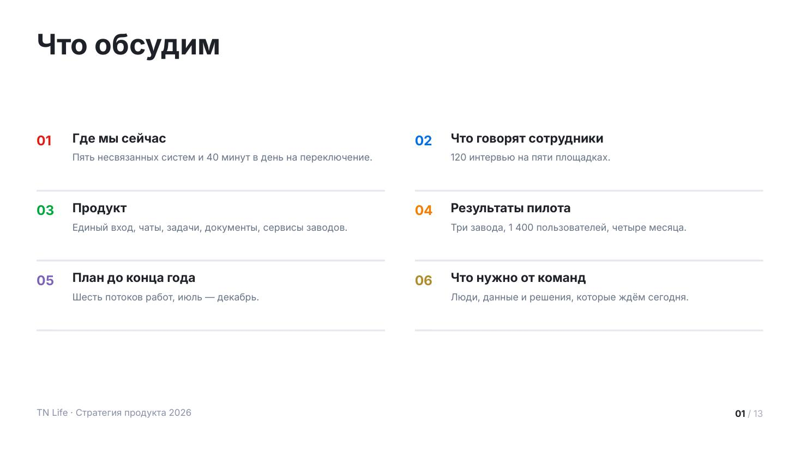
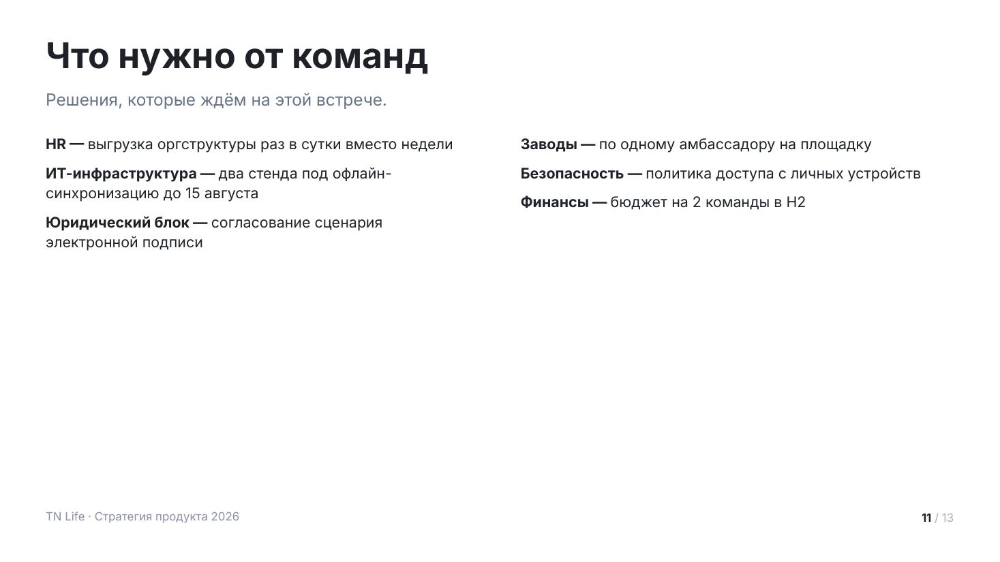
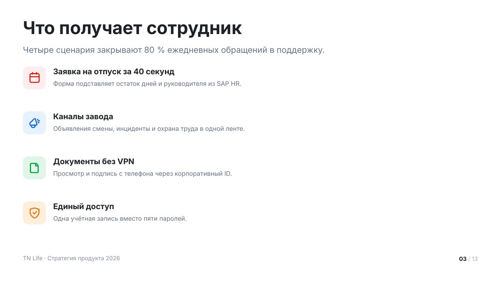
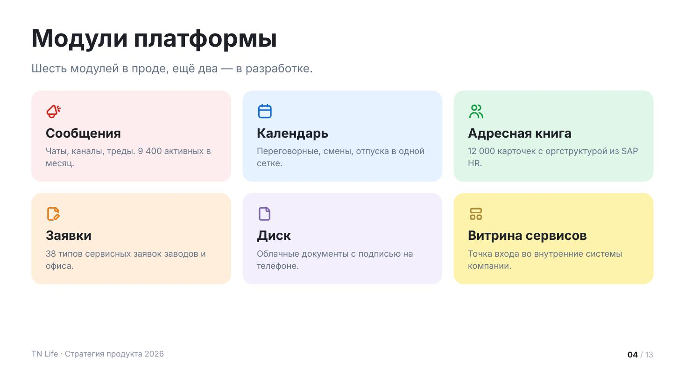
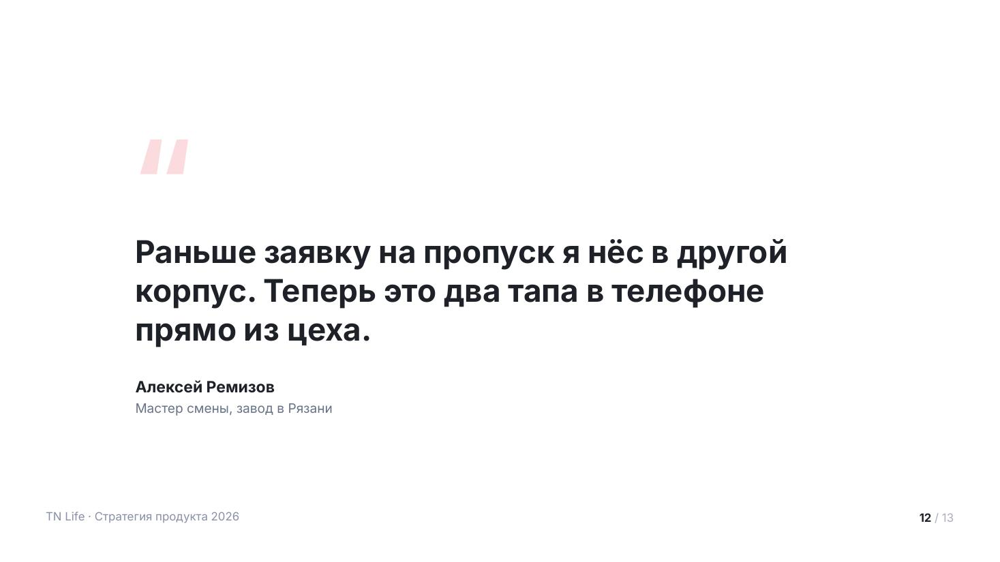

# Текстовые макеты

Оглавление, списки и карточки. Все с колонтитулом и номером страницы.

Сниппеты предполагают подключённый пролог — см. [README.md](README.md).

## `agenda` — оглавление



Что будет в деке. Номера раскрашены по акцентам, под каждым пунктом —
поясняющая строка, снизу тонкая линейка.

От 4 до 10 пунктов. Больше 5 — автоматически в две колонки. Пояснение под пунктом
не обязательно, но с ним оглавление становится кратким пересказом, а не списком
рубрик.

| Поле | Значение |
|---|---|
| `title` | заголовок, обычно «Что обсудим» |
| `lead` | необязательный лид |
| `columns` | 1 или 2, по умолчанию 2 при >5 пунктах |
| `items[].title` | название пункта |
| `items[].note` | пояснение, одна строка |
| `items[].number` | свой номер вместо порядкового |
| `items[].tone` | свой акцент вместо чередования |

<details><summary>Сниппет</summary>

```js
function agenda(p, d) {
  const s = p.addSlide();
  s.background = { color: TN.hex(C.white) };
  const y0 = TN.header(s, d);

  const items = d.items;
  const cols = d.columns || (items.length > 5 ? 2 : 1);
  const gap = 72, colW = Math.floor((CW - gap * (cols - 1)) / cols);
  const rows = Math.ceil(items.length / cols);
  const avail = TN.contentBottom() - y0;
  const rowH = Math.max(96, Math.min(168, Math.floor(avail / rows)));
  const top = y0 + Math.max(0, (avail - rowH * rows) / 2);

  items.forEach((it, i) => {
    const a = TN.accent(i, it.tone);
    const x = MX + (i % cols) * (colW + gap);
    const y = top + Math.floor(i / cols) * rowH;
    TN.txt(s, TN.pad2(it.number || i + 1), { x, y: y + 2, w: 70, h: 44, size: 32, bold: true, color: a.solid });
    TN.txt(s, it.title, { x: x + 86, y, w: colW - 86, h: 42, size: 30, bold: true, lh: 1.15 });
    if (it.note) TN.txt(s, it.note, { x: x + 86, y: y + 46, w: colW - 86, h: rowH - 74, size: 23, color: C.n60, lh: 1.35 });
    TN.hline(s, p, { x, y: y + rowH - 24, w: colW });
  });
  chrome(s, p);
}
```
</details>

Пример вызова:

```js
agenda(p, {
    title: 'Что обсудим',
    items: [
      { title: 'Где мы сейчас', note: 'Пять несвязанных систем и 40 минут в день на переключение.' },
      { title: 'Что говорят сотрудники', note: '120 интервью на пяти площадках.' },
      { title: 'Продукт', note: 'Единый вход, чаты, задачи, документы, сервисы заводов.' },
      { title: 'Результаты пилота', note: 'Три завода, 1 400 пользователей, четыре месяца.' },
      { title: 'План до конца года', note: 'Шесть потоков работ, июль — декабрь.' },
      { title: 'Что нужно от команд', note: 'Люди, данные и решения, которые ждём сегодня.' },
    ],
  });
```

## `bullets` — маркированный список



Простое перечисление, когда иллюстрировать нечего. Самый скучный макет —
применяй, когда остальные не подходят, и не два раза подряд.

Элемент — либо строка, либо `{ title, text }`: тогда получается «**Заголовок** — текст».
До 8 пунктов; больше — либо две колонки, либо два слайда.

| Поле | Значение |
|---|---|
| `title` | заголовок слайда |
| `lead` | лид |
| `columns` | 1 или 2 |
| `items` | массив строк или `{ title, text }` |
| `tone` | `light` — серый фон слайда |

<details><summary>Сниппет</summary>

```js
function bulletsSlide(p, d) {
  const s = p.addSlide();
  s.background = { color: TN.hex(d.tone === 'light' ? C.n15 : C.white) };
  const y0 = TN.header(s, d);

  const cols = d.columns || 1;
  const gap = 80, colW = Math.floor((CW - gap * (cols - 1)) / cols);
  const per = Math.ceil(d.items.length / cols);
  const size = d.items.length > 8 ? 26 : T.body;
  for (let c = 0; c < cols; c++) {
    const part = d.items.slice(c * per, (c + 1) * per);
    if (part.length) TN.bullets(s, part, { x: MX + c * (colW + gap), y: y0, w: colW, h: TN.contentBottom() - y0, size });
  }
  chrome(s, p);
}
```
</details>

Пример вызова:

```js
bulletsSlide(p, {
    title: 'Что нужно от команд',
    lead: 'Решения, которые ждём на этой встрече.',
    columns: 2,
    items: [
      { title: 'HR', text: 'выгрузка оргструктуры раз в сутки вместо недели' },
      { title: 'ИТ-инфраструктура', text: 'два стенда под офлайн-синхронизацию до 15 августа' },
      { title: 'Юридический блок', text: 'согласование сценария электронной подписи' },
      { title: 'Заводы', text: 'по одному амбассадору на площадку' },
      { title: 'Безопасность', text: 'политика доступа с личных устройств' },
      { title: 'Финансы', text: 'бюджет на 2 команды в H2' },
    ],
  });
```

## `features` — возможности строками



Иконка в цветной плитке, заголовок, пояснение. Для сценариев и возможностей
продукта, когда у каждого пункта есть своя иконка.

До 6 строк. Акценты чередуются; `mono: true` делает все плитки красными — так лучше,
когда пункты однородны. Иконка не нашлась в спрайте — на её месте появится номер.

| Поле | Значение |
|---|---|
| `title` | заголовок слайда |
| `lead` | лид |
| `mono` | `true` — все иконки красные |
| `items[].icon` | имя из `assets/icon-names.json` |
| `items[].title` | заголовок строки |
| `items[].text` | пояснение, 1–2 строки |
| `items[].tone` | свой акцент |

<details><summary>Сниппет</summary>

```js
async function features(p, d) {
  const s = p.addSlide();
  s.background = { color: TN.hex(d.tone === 'light' ? C.n15 : C.white) };
  const y0 = TN.header(s, d);

  const items = d.items.slice(0, 6);
  const avail = TN.contentBottom() - y0;
  const rowH = Math.max(104, Math.min(190, Math.floor(avail / items.length)));
  const top = y0 + Math.max(0, (avail - rowH * items.length) / 2);
  const tile = Math.min(88, rowH - 34);

  for (let i = 0; i < items.length; i++) {
    const it = items[i];
    const a = TN.accent(d.mono ? 0 : i, it.tone);
    const y = top + i * rowH;
    TN.rect(s, p, { x: MX, y, w: tile, h: tile, fill: a.tint, r: 20 });
    const ok = await TN.putIcon(s, it.icon, a.solid, { x: MX + tile * 0.24, y: y + tile * 0.24, w: tile * 0.52 });
    if (!ok) TN.txt(s, TN.pad2(i + 1), { x: MX, y: y + tile / 2 - 20, w: tile, h: 40, size: 30, bold: true, color: a.solid, align: 'center' });
    const tx = MX + tile + 28, tw = CW - tile - 28;
    TN.txt(s, it.title, { x: tx, y: y + 2, w: tw, h: 42, size: T.h4, bold: true, lh: 1.15 });
    if (it.text) TN.txt(s, it.text, { x: tx, y: y + 46, w: tw, h: rowH - 60, size: T.small, color: C.n60, lh: 1.4 });
  }
  chrome(s, p);
}
```
</details>

Пример вызова:

```js
await features(p, {
    title: 'Что получает сотрудник',
    lead: 'Четыре сценария закрывают 80 % ежедневных обращений в поддержку.',
    items: [
      { icon: 'calendar', title: 'Заявка на отпуск за 40 секунд', text: 'Форма подставляет остаток дней и руководителя из SAP HR.' },
      { icon: 'channel', title: 'Каналы завода', text: 'Объявления смены, инциденты и охрана труда в одной ленте.' },
      { icon: 'document', title: 'Документы без VPN', text: 'Просмотр и подпись с телефона через корпоративный ID.' },
      { icon: 'protect', title: 'Единый доступ', text: 'Одна учётная запись вместо пяти паролей.' },
    ],
  });
```

## `cards` — карточки сеткой



Равноправные блоки: модули, направления, команды. Высота карточки считается
по самому длинному тексту в ряду, поэтому ряд всегда ровный.

До 8 карточек. Колонки подбираются сами: 2 карточки → 2 колонки, 3–4 → по числу
карточек, больше → 3 колонки. `fill: 'solid'` заливает карточку акцентом целиком —
так выделяют одну главную, не все.

| Поле | Значение |
|---|---|
| `title` | заголовок слайда |
| `lead` | лид |
| `columns` | 2, 3 или 4 |
| `mono` | `true` — все карточки в красном |
| `items[].icon` | имя иконки |
| `items[].title` | заголовок карточки |
| `items[].text` | описание |
| `items[].tone` | свой акцент |
| `items[].fill` | `tint` (по умолчанию), `solid`, `plain` |

<details><summary>Сниппет</summary>

```js
async function cards(p, d) {
  const s = p.addSlide();
  s.background = { color: TN.hex(d.tone === 'light' ? C.n15 : C.white) };
  const y0 = TN.header(s, d);

  const items = d.items.slice(0, 8);
  const cols = d.columns || (items.length <= 2 ? 2 : items.length <= 4 ? Math.min(items.length, 4) : 3);
  const rows = Math.ceil(items.length / cols);
  const gap = 32, pdx = 40, pdy = 36;
  const cw = Math.floor((CW - gap * (cols - 1)) / cols);
  const availH = TN.contentBottom() - y0;

  // высота карточки — по самому длинному контенту, чтобы ряд был ровным
  let need = 0;
  for (const it of items) {
    const tH = TN.blockH(it.title, cw - pdx * 2, T.h3, true, 1.15);
    const xH = it.text ? TN.blockH(it.text, cw - pdx * 2, T.small, false, 1.42) + 12 : 0;
    need = Math.max(need, pdy * 2 + (it.icon ? 62 : 0) + tH + xH);
  }
  const slot = Math.floor((availH - gap * (rows - 1)) / rows);
  const ch = Math.min(slot, Math.max(need, Math.round(slot * 0.72)));

  for (let i = 0; i < items.length; i++) {
    const it = items[i];
    const a = TN.accent(d.mono ? 0 : i, it.tone);
    const x = MX + (i % cols) * (cw + gap);
    const y = y0 + Math.floor(i / cols) * (ch + gap);
    const solid = it.fill === 'solid';
    TN.rect(s, p, { x, y, w: cw, h: ch, r: 28, fill: solid ? a.solid : it.fill === 'plain' ? C.n15 : a.tint });

    let cy = y + pdy;
    if (it.icon && await TN.putIcon(s, it.icon, solid ? C.white : a.solid, { x: x + pdx, y: cy, w: 44 })) cy += 62;
    const tH = TN.blockH(it.title, cw - pdx * 2, T.h3, true, 1.15);
    TN.txt(s, it.title, { x: x + pdx, y: cy, w: cw - pdx * 2, h: tH + 6, size: T.h3, bold: true, lh: 1.15, color: solid ? C.white : C.n100 });
    cy += tH + 10;
    if (it.text) TN.txt(s, it.text, { x: x + pdx, y: cy, w: cw - pdx * 2, h: Math.max(30, y + ch - pdy - cy), size: T.small, lh: 1.42, color: solid ? C.onRedDim : C.n60 });
  }
  chrome(s, p);
}
```
</details>

Пример вызова:

```js
await cards(p, {
    title: 'Модули платформы',
    lead: 'Шесть модулей в проде, ещё два — в разработке.',
    items: [
      { icon: 'channel', title: 'Сообщения', text: 'Чаты, каналы, треды. 9 400 активных в месяц.' },
      { icon: 'calendar', title: 'Календарь', text: 'Переговорные, смены, отпуска в одной сетке.' },
      { icon: 'people', title: 'Адресная книга', text: '12 000 карточек с оргструктурой из SAP HR.' },
      { icon: 'request', title: 'Заявки', text: '38 типов сервисных заявок заводов и офиса.' },
      { icon: 'document', title: 'Диск', text: 'Облачные документы с подписью на телефоне.' },
      { icon: 'widget', title: 'Витрина сервисов', text: 'Точка входа во внутренние системы компании.' },
    ],
  });
```

## `quote` — цитата



Слова реального человека: пользователя, заказчика, руководителя. Работает
там, где цифры уже показаны и нужен живой голос.

До 200 знаков. Цитата дословная — не сокращай и не причёсывай. Должность обязательна:
без неё непонятно, почему этому человеку верить.

| Поле | Значение |
|---|---|
| `text` | цитата дословно |
| `author` | имя и фамилия |
| `role` | должность и место работы |
| `avatar` | путь к фото, ставится кружком |
| `tone` | `light` — серый фон |

<details><summary>Сниппет</summary>

```js
function quote(p, d) {
  const s = p.addSlide();
  s.background = { color: TN.hex(d.tone === 'light' ? C.n15 : C.white) };
  const w = 1440, x = (W - w) / 2;

  const ft = TN.fit(d.text, { w: w - 40, h: 420, size: T.quote, min: 38, bold: true, lh: 1.25 });
  const th = ft.lines * ft.size * 1.25;
  let y = Math.max(230, (H - th - (d.author ? 120 : 0) - 150) / 2 + 150);

  TN.txt(s, '“', { x: x + 12, y: y - 190, w: 300, h: 220, size: 220, bold: true, color: C.red15, lh: 1 });
  TN.txt(s, d.text, { x: x + 20, y, w: w - 40, h: th + 10, size: ft.size, bold: true, lh: 1.25 });
  y += th + 56;

  if (d.author) {
    let tx = x + 20;
    if (d.avatar && TN.assetPath(d.avatar)) {
      s.addImage({ path: TN.assetPath(d.avatar), x: px(tx), y: px(y - 6), w: px(88), h: px(88), sizing: { type: 'cover', w: px(88), h: px(88) }, rounding: true });
      tx += 112;
    }
    TN.txt(s, d.author, { x: tx, y, w: 900, h: 42, size: 30, bold: true });
    if (d.role) TN.txt(s, d.role, { x: tx, y: y + 44, w: 900, h: 38, size: 25, color: C.n60 });
  }
  chrome(s, p);
}
```
</details>

Пример вызова:

```js
quote(p, {
    text: 'Раньше заявку на пропуск я нёс в другой корпус. Теперь это два тапа в телефоне прямо из цеха.',
    author: 'Алексей Ремизов',
    role: 'Мастер смены, завод в Рязани',
  });
```
