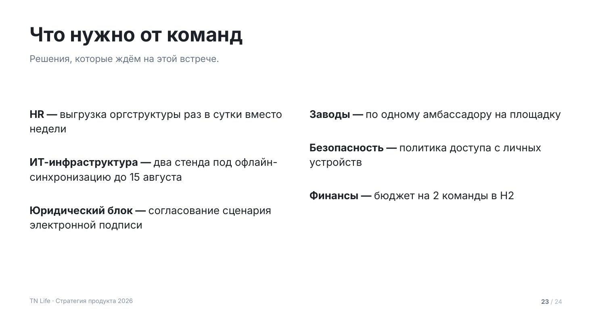
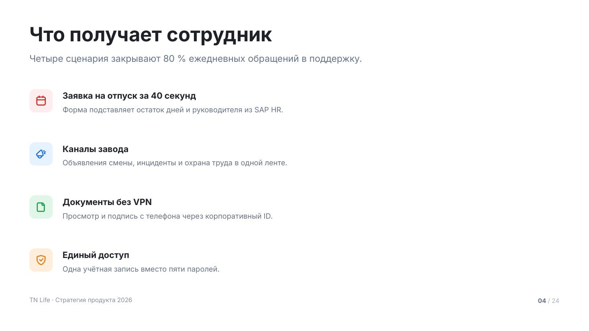
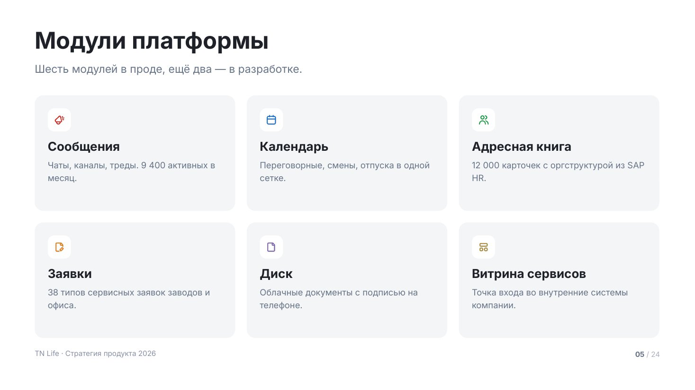
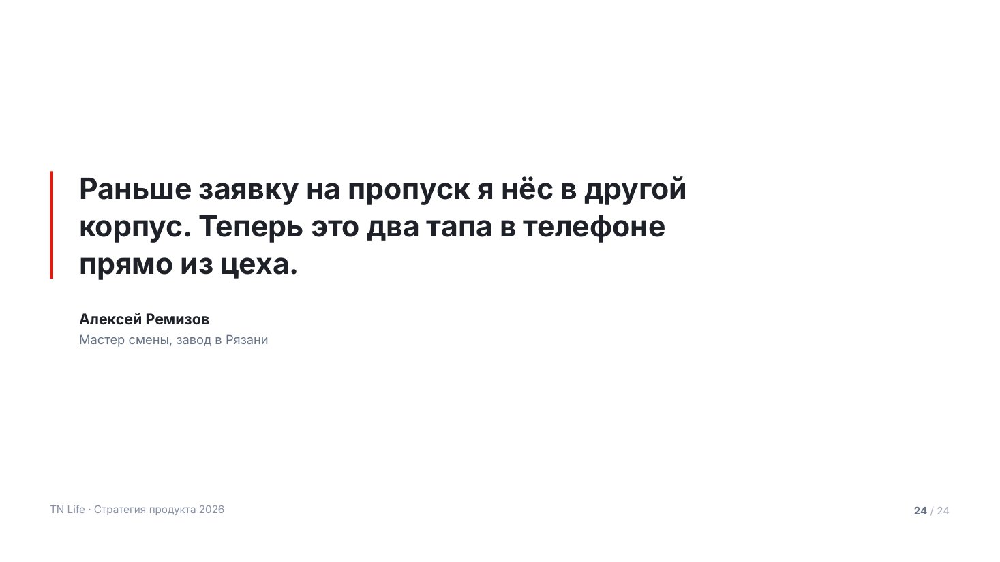
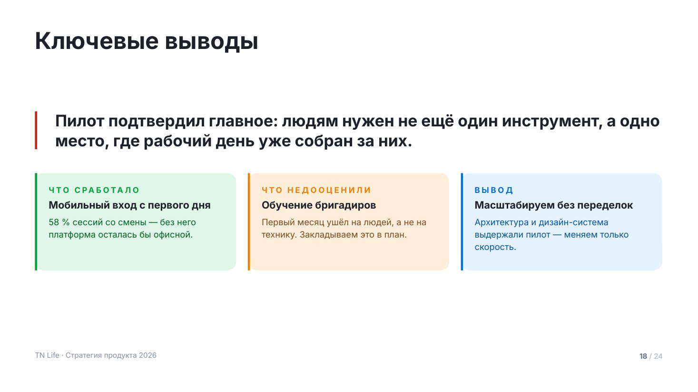

# Текстовые макеты

Оглавление, списки и карточки. Все с колонтитулом и номером страницы.

Сниппеты предполагают подключённый пролог — см. [README.md](README.md).

Общее правило этих макетов: высота строки или карточки считается по содержимому,
свободное место уходит в межстрочные зазоры и в оптический центр, а не в растянутую
пустую карточку. Помогают три примитива пролога — `TN.rows()`, `TN.boxH()`
и `TN.place()`, см. [rules/layout.md](../rules/layout.md).

## `agenda` — оглавление


Что будет в деке. Номера раскрашены по акцентам, под каждым пунктом —
поясняющая строка, между пунктами — тонкая линейка.

От 4 до 10 пунктов. Больше 5 — автоматически в две колонки. Пояснение под пунктом
не обязательно, но с ним оглавление становится кратким пересказом, а не списком
рубрик.

| Поле | Значение |
|---|---|
| `title` | заголовок, обычно «Что обсудим» |
| `lead` | необязательный лид |
| `columns` | 1 или 2, по умолчанию 2 при >5 пунктах |
| `items[].title` | название пункта |
| `items[].note` | пояснение, одна строка |
| `items[].number` | свой номер вместо порядкового |
| `items[].tone` | свой акцент вместо чередования |

<details><summary>Сниппет</summary>

```js
function agenda(p, d) {
  const s = p.addSlide();
  s.background = { color: TN.hex(C.bg) };
  const y0 = TN.header(s, d);

  const items = d.items.slice(0, 10);
  const cols = d.columns || (items.length > 5 ? 2 : 1);
  const gap = 80, colW = Math.floor((CW - gap * (cols - 1)) / cols);
  const numW = 76, tw = colW - numW;

  // высота строки — по самой длинной паре «название + пояснение»
  let rowH = 0;
  for (const it of items) {
    const tH = TN.blockH(it.title, tw, T.h4, true, 1.2);
    const nH = it.note ? TN.blockH(it.note, tw, T.small, false, 1.35) + 10 : 0;
    rowH = Math.max(rowH, tH + nH);
  }
  const n = Math.ceil(items.length / cols);
  const { top, step, gap: rg } = TN.rows(y0, TN.contentBottom(), n, rowH, { min: 32, max: 132, bias: 0.38 });

  items.forEach((it, i) => {
    const a = TN.accent(i, it.tone);
    const x = MX + (i % cols) * (colW + gap);
    const y = top + Math.floor(i / cols) * step;
    if (i >= cols) TN.hline(s, p, { x, y: Math.round(y - rg / 2), w: colW, color: C.line, width: 1 });

    TN.txt(s, TN.pad2(it.number || i + 1), { x, y: y + 2, w: numW - 16, h: 40, size: T.h4, bold: true, color: a.solid });
    const tH = TN.blockH(it.title, tw, T.h4, true, 1.2);
    TN.txt(s, it.title, { x: x + numW, y, w: tw, h: tH + 6, size: T.h4, bold: true, lh: 1.2 });
    if (it.note) TN.txt(s, it.note, { x: x + numW, y: y + tH + 10, w: tw, h: rowH - tH, size: T.small, color: C.muted, lh: 1.35 });
  });
  chrome(s, p);
}
```
</details>

Пример вызова:

```js
agenda(p, {
    title: 'Что обсудим',
    items: [
      { title: 'Где мы сейчас', note: 'Пять несвязанных систем и 40 минут в день на переключение.' },
      { title: 'Что говорят сотрудники', note: '120 интервью на пяти площадках.' },
      { title: 'Продукт', note: 'Единый вход, чаты, задачи, документы, сервисы заводов.' },
      { title: 'Результаты пилота', note: 'Три завода, 1 400 пользователей, четыре месяца.' },
      { title: 'План до конца года', note: 'Шесть потоков работ, июль — декабрь.' },
      { title: 'Что нужно от команд', note: 'Люди, данные и решения, которые ждём сегодня.' },
    ],
  });
```

## `bullets` — маркированный список



Простое перечисление, когда иллюстрировать нечего. Самый скучный макет —
применяй, когда остальные не подходят, и не два раза подряд.

Элемент — либо строка, либо `{ title, text }`: тогда получается «**Заголовок** — текст».
Кегль подбирается под количество пунктов, чтобы список занимал колонку, а не жался
к заголовку: четыре пункта набираются крупно, восемь — мельче. До 8 пунктов;
больше — либо две колонки, либо два слайда.

| Поле | Значение |
|---|---|
| `title` | заголовок слайда |
| `lead` | лид |
| `columns` | 1 или 2 |
| `items` | массив строк или `{ title, text }` |
| `size` | зафиксировать кегль вместо автоподбора |
| `tone` | `light` — серый фон слайда |

<details><summary>Сниппет</summary>

```js
function bulletsSlide(p, d) {
  const s = p.addSlide();
  s.background = { color: TN.hex(d.tone === 'light' ? C.surface : C.bg) };
  const y0 = TN.header(s, d);

  const items = d.items;
  const cols = d.columns || 1;
  const gap = 88, colW = Math.floor((CW - gap * (cols - 1)) / cols);
  const per = Math.ceil(items.length / cols);
  const avail = TN.contentBottom() - y0;
  const text = (it) => (it && typeof it === 'object' ? [it.title, it.text].filter(Boolean).join(' — ') : String(it));

  // высота списка при заданном кегле: строки плюс отбивки между пунктами
  const listH = (part, size, sp) => part.reduce((h, it) => h + TN.blockH(text(it), colW - 44, size, false, 1.4), 0) + sp * (part.length - 1);

  // самый крупный кегль, при котором самая длинная колонка укладывается в зону
  let size = d.size || T.small, sp = 18;
  if (!d.size) {
    for (const cand of [T.body + 8, T.body + 4, T.body, T.small + 2, T.small]) {
      const s2 = Math.round(cand * 0.7);
      const max = Math.max(...Array.from({ length: cols }, (_, c) => listH(items.slice(c * per, (c + 1) * per), cand, s2)));
      if (max <= avail * 0.94) { size = cand; sp = s2; break; }
    }
  }

  // свободное место уходит в отбивки между пунктами, а не в пустоту под списком
  const textH = Math.max(...Array.from({ length: cols }, (_, c) => listH(items.slice(c * per, (c + 1) * per), size, 0)));
  if (!d.size && per > 1) sp = Math.max(sp, Math.min(size * 1.8, (avail * 0.88 - textH) / (per - 1)));
  const need = textH + sp * (per - 1);
  const top = TN.place(y0, TN.contentBottom(), need, 0.3);

  for (let c = 0; c < cols; c++) {
    const part = items.slice(c * per, (c + 1) * per);
    if (part.length) TN.bullets(s, part, { x: MX + c * (colW + gap), y: top, w: colW, h: TN.contentBottom() - top, size, gap: sp });
  }
  chrome(s, p);
}
```
</details>

Пример вызова:

```js
bulletsSlide(p, {
    title: 'Что нужно от команд',
    lead: 'Решения, которые ждём на этой встрече.',
    columns: 2,
    items: [
      { title: 'HR', text: 'выгрузка оргструктуры раз в сутки вместо недели' },
      { title: 'ИТ-инфраструктура', text: 'два стенда под офлайн-синхронизацию до 15 августа' },
      { title: 'Юридический блок', text: 'согласование сценария электронной подписи' },
      { title: 'Заводы', text: 'по одному амбассадору на площадку' },
      { title: 'Безопасность', text: 'политика доступа с личных устройств' },
      { title: 'Финансы', text: 'бюджет на 2 команды в H2' },
    ],
  });
```

## `features` — возможности строками



Иконка в цветной плитке, заголовок, пояснение. Для сценариев и возможностей
продукта, когда у каждого пункта есть своя иконка.

До 6 строк. Акценты чередуются; `mono: true` делает все плитки красными — так лучше,
когда пункты однородны. Иконка не нашлась в спрайте — на её месте появится номер.

| Поле | Значение |
|---|---|
| `title` | заголовок слайда |
| `lead` | лид |
| `mono` | `true` — все иконки красные |
| `items[].icon` | имя из `assets/icon-names.json` |
| `items[].title` | заголовок строки |
| `items[].text` | пояснение, 1–2 строки |
| `items[].tone` | свой акцент |

<details><summary>Сниппет</summary>

```js
async function features(p, d) {
  const s = p.addSlide();
  s.background = { color: TN.hex(d.tone === 'light' ? C.surface : C.bg) };
  const y0 = TN.header(s, d);

  const items = d.items.slice(0, 6);
  const tileW = 76, tx = MX + tileW + 32, tw = CW - tileW - 32;

  let rowH = 0;
  for (const it of items) {
    const tH = TN.blockH(it.title, tw, T.h4, true, 1.2);
    const xH = it.text ? TN.blockH(it.text, tw, T.small, false, 1.4) + 10 : 0;
    rowH = Math.max(rowH, tileW, tH + xH);
  }
  const { top, step } = TN.rows(y0, TN.contentBottom(), items.length, rowH, { min: 28, max: 96, bias: 0.36 });

  for (let i = 0; i < items.length; i++) {
    const it = items[i];
    const a = TN.accent(d.mono ? 0 : i, it.tone);
    const y = top + i * step;
    const ok = await TN.tile(s, p, { x: MX, y, size: tileW, fill: a.tint, icon: it.icon, color: a.solid });
    if (!ok) TN.txt(s, TN.pad2(i + 1), { x: MX, y: y + (tileW - 34) / 2, w: tileW, h: 36, size: T.h4, bold: true, color: a.solid, align: 'center' });

    const tH = TN.blockH(it.title, tw, T.h4, true, 1.2);
    TN.txt(s, it.title, { x: tx, y: y + 4, w: tw, h: tH + 6, size: T.h4, bold: true, lh: 1.2 });
    if (it.text) TN.txt(s, it.text, { x: tx, y: y + tH + 14, w: tw, h: rowH - tH, size: T.small, color: C.muted, lh: 1.4 });
  }
  chrome(s, p);
}
```
</details>

Пример вызова:

```js
await features(p, {
    title: 'Что получает сотрудник',
    lead: 'Четыре сценария закрывают 80 % ежедневных обращений в поддержку.',
    items: [
      { icon: 'calendar', title: 'Заявка на отпуск за 40 секунд', text: 'Форма подставляет остаток дней и руководителя из SAP HR.' },
      { icon: 'channel', title: 'Каналы завода', text: 'Объявления смены, инциденты и охрана труда в одной ленте.' },
      { icon: 'document', title: 'Документы без VPN', text: 'Просмотр и подпись с телефона через корпоративный ID.' },
      { icon: 'protect', title: 'Единый доступ', text: 'Одна учётная запись вместо пяти паролей.' },
    ],
  });
```

## `cards` — карточки сеткой



Равноправные блоки: модули, направления, команды. Карточка стоит на нейтральной
подложке, цвет несёт иконка — так шесть карточек не превращаются в шесть цветных
плашек. Высота считается по самому длинному тексту в ряду, поэтому ряд всегда ровный.

До 8 карточек. Колонки подбираются сами: 2 карточки → 2 колонки, 3–4 → по числу
карточек, больше → 3 колонки. `fill: 'solid'` заливает карточку акцентом целиком —
так выделяют одну главную, не все.

| Поле | Значение |
|---|---|
| `title` | заголовок слайда |
| `lead` | лид |
| `columns` | 2, 3 или 4 |
| `mono` | `true` — все иконки в красном |
| `items[].icon` | имя иконки |
| `items[].title` | заголовок карточки |
| `items[].text` | описание |
| `items[].tone` | свой акцент |
| `items[].fill` | `plain` (по умолчанию), `tint`, `solid` |

<details><summary>Сниппет</summary>

```js
async function cards(p, d) {
  const s = p.addSlide();
  const light = d.tone === 'light';
  s.background = { color: TN.hex(light ? C.surface : C.bg) };
  const y0 = TN.header(s, d);

  const items = d.items.slice(0, 8);
  const cols = d.columns || (items.length <= 2 ? 2 : items.length <= 4 ? Math.min(items.length, 4) : 3);
  const n = Math.ceil(items.length / cols);
  const gap = 32, pdx = 36, pdy = 36, tileW = 64;
  const cw = Math.floor((CW - gap * (cols - 1)) / cols), iw = cw - pdx * 2;

  // высота карточки — по самому длинному содержимому в деке карточек
  let need = 0;
  for (const it of items) {
    const tH = TN.blockH(it.title, iw, T.h3, true, 1.2);
    const xH = it.text ? TN.blockH(it.text, iw, T.small, false, 1.45) + 12 : 0;
    need = Math.max(need, pdy * 2 + (it.icon ? tileW + 20 : 0) + tH + xH);
  }
  const slot = Math.floor(((TN.contentBottom() - y0) - gap * (n - 1)) / n);
  const ch = TN.boxH(need, slot, { grow: n === 1 ? 1.4 : 1.18 });
  const top = TN.place(y0, TN.contentBottom(), ch * n + gap * (n - 1), 0.36);

  for (let i = 0; i < items.length; i++) {
    const it = items[i];
    const a = TN.accent(d.mono ? 0 : i, it.tone);
    const x = MX + (i % cols) * (cw + gap);
    const y = top + Math.floor(i / cols) * (ch + gap);
    const solid = it.fill === 'solid';
    TN.rect(s, p, { x, y, w: cw, h: ch, r: TN.R.card,
      fill: solid ? a.solid : it.fill === 'tint' ? a.tint : light ? C.bg : C.surface });

    let cy = y + pdy;
    if (it.icon) {
      const ok = await TN.tile(s, p, { x: x + pdx, y: cy, size: tileW, r: TN.R.tile,
        fill: solid ? a.deep : light ? C.surface : C.bg, icon: it.icon, color: solid ? C.onAccent : a.solid });
      if (ok) cy += tileW + 20;
    }
    const tH = TN.blockH(it.title, iw, T.h3, true, 1.2);
    TN.txt(s, it.title, { x: x + pdx, y: cy, w: iw, h: tH + 6, size: T.h3, bold: true, lh: 1.2, color: solid ? C.onAccent : C.ink });
    cy += tH + 12;
    if (it.text) TN.txt(s, it.text, { x: x + pdx, y: cy, w: iw, h: Math.max(30, y + ch - pdy - cy), size: T.small, lh: 1.45,
      color: solid ? C.onAccentDim : C.muted });
  }
  chrome(s, p);
}
```
</details>

Пример вызова:

```js
await cards(p, {
    title: 'Модули платформы',
    lead: 'Шесть модулей в проде, ещё два — в разработке.',
    items: [
      { icon: 'channel', title: 'Сообщения', text: 'Чаты, каналы, треды. 9 400 активных в месяц.' },
      { icon: 'calendar', title: 'Календарь', text: 'Переговорные, смены, отпуска в одной сетке.' },
      { icon: 'people', title: 'Адресная книга', text: '12 000 карточек с оргструктурой из SAP HR.' },
      { icon: 'request', title: 'Заявки', text: '38 типов сервисных заявок заводов и офиса.' },
      { icon: 'document', title: 'Диск', text: 'Облачные документы с подписью на телефоне.' },
      { icon: 'widget', title: 'Витрина сервисов', text: 'Точка входа во внутренние системы компании.' },
    ],
  });
```

## `quote` — цитата



Слова реального человека: пользователя, заказчика, руководителя. Работает
там, где цифры уже показаны и нужен живой голос. Слева — акцентная черта во всю
высоту цитаты, она держит блок на странице.

До 200 знаков. Цитата дословная — не сокращай и не причёсывай. Должность обязательна:
без неё непонятно, почему этому человеку верить.

| Поле | Значение |
|---|---|
| `text` | цитата дословно |
| `author` | имя и фамилия |
| `role` | должность и место работы |
| `avatar` | путь к фото, ставится кружком |
| `tone` | `light` — серый фон |

<details><summary>Сниппет</summary>

```js
function quote(p, d) {
  const s = p.addSlide();
  s.background = { color: TN.hex(d.tone === 'light' ? C.surface : C.bg) };

  const rule = 6, tx = MX + 56, tw = 1280;
  const ft = TN.fit(d.text, { w: tw, h: 440, size: T.quote, min: 36, bold: true, lh: 1.28 });
  const th = ft.lines * ft.size * 1.28;
  const authH = d.author ? (d.role ? 84 : 44) : 0;
  const need = th + (authH ? 56 + authH : 0);
  let y = TN.place(MT + 40, TN.contentBottom(), need, 0.44);

  TN.rect(s, p, { x: MX, y: y + 6, w: rule, h: th - 8, fill: C.accent });
  TN.txt(s, d.text, { x: tx, y, w: tw, h: th + 10, size: ft.size, bold: true, lh: 1.28, color: C.ink });
  y += th + 56;

  if (d.author) {
    let ax = tx;
    if (d.avatar && TN.assetPath(d.avatar)) {
      s.addImage({ path: TN.assetPath(d.avatar), x: px(ax), y: px(y - 8), w: px(84), h: px(84), sizing: { type: 'cover', w: px(84), h: px(84) }, rounding: true });
      ax += 108;
    }
    TN.txt(s, d.author, { x: ax, y, w: 900, h: 40, size: T.h4, bold: true });
    if (d.role) TN.txt(s, d.role, { x: ax, y: y + 42, w: 900, h: 36, size: T.small, color: C.muted });
  }
  chrome(s, p);
}
```
</details>

Пример вызова:

```js
quote(p, {
    text: 'Раньше заявку на пропуск я нёс в другой корпус. Теперь это два тапа в телефоне прямо из цеха.',
    author: 'Алексей Ремизов',
    role: 'Мастер смены, завод в Рязани',
  });
```

## `takeaways` — выводы



Главный вывод крупно и рядом — из чего он сложился. Ставится после блока
доказательств: цифры уже показаны, здесь их смысл.

Вывод — одно предложение до 140 знаков. Колонок две–четыре, и они не равны
друг другу по смыслу: «что сработало», «что недооценили», «что делаем дальше».
Надзаголовок колонки называет роль, а не повторяет заголовок.

| Поле | Значение |
|---|---|
| `title` | заголовок слайда |
| `lead` | лид |
| `text` | сам вывод, до 140 знаков |
| `items[].label` | надзаголовок колонки |
| `items[].title` | утверждение |
| `items[].text` | пояснение |
| `items[].tone` | свой акцент |

<details><summary>Сниппет</summary>

```js
function takeaways(p, d) {
  const s = p.addSlide();
  s.background = { color: TN.hex(C.bg) };
  const y0 = TN.header(s, d);
  const bottom = TN.contentBottom();

  const items = d.items.slice(0, 4);
  const gap = 32, pd = 32, rule = 6;
  const cw = Math.floor((CW - gap * (items.length - 1)) / items.length);
  const iw = cw - pd * 2 - rule;

  const tw = CW - 56;
  const ft = TN.fit(d.text, { w: tw, h: 280, size: T.h3 + 10, min: 32, bold: true, lh: 1.25 });
  const th = ft.lines * ft.size * 1.25;

  let need = 0;
  for (const it of items) {
    const eH = it.label ? 38 : 0;
    const tH = TN.blockH(it.title, iw, T.h4, true, 1.2);
    const xH = it.text ? TN.blockH(it.text, iw, T.small, false, 1.4) + 12 : 0;
    need = Math.max(need, pd * 2 + eH + tH + xH);
  }
  const ch = TN.boxH(need, bottom - y0 - th - 64, { grow: 1.08 });
  const top = TN.place(y0, bottom, th + 64 + ch, 0.36);

  TN.rect(s, p, { x: MX, y: top + 4, w: rule, h: th - 6, fill: C.accent });
  TN.txt(s, d.text, { x: MX + 56, y: top, w: tw, h: th + 10, size: ft.size, bold: true, lh: 1.25 });

  const cy = top + th + 64;
  items.forEach((it, i) => {
    const a = TN.accent(i, it.tone);
    const x = MX + i * (cw + gap);
    TN.rect(s, p, { x, y: cy, w: cw, h: ch, r: TN.R.card, fill: a.tint });
    TN.rect(s, p, { x, y: cy, w: rule, h: ch, fill: a.solid });

    let iy = cy + pd;
    if (it.label) {
      TN.txt(s, String(it.label).toUpperCase(), { x: x + pd + rule, y: iy, w: iw, h: 30, size: T.eyebrow, bold: true,
        spacing: 2.4, color: a.solid, font: TN.MONO || TN.FONT });
      iy += 38;
    }
    const tH = TN.blockH(it.title, iw, T.h4, true, 1.2);
    TN.txt(s, it.title, { x: x + pd + rule, y: iy, w: iw, h: tH + 6, size: T.h4, bold: true, lh: 1.2 });
    if (it.text) TN.txt(s, it.text, { x: x + pd + rule, y: iy + tH + 12, w: iw, h: ch - (iy - cy) - tH - pd, size: T.small, lh: 1.4, color: a.deep });
  });
  chrome(s, p);
}
```
</details>

Пример вызова:

```js
takeaways(p, {
    title: 'Ключевые выводы',
    text: 'Пилот подтвердил главное: людям нужен не ещё один инструмент, а одно место, где рабочий день уже собран за них.',
    items: [
      { label: 'Что сработало', tone: 'green', title: 'Мобильный вход с первого дня',
        text: '58 % сессий со смены — без него платформа осталась бы офисной.' },
      { label: 'Что недооценили', tone: 'orange', title: 'Обучение бригадиров',
        text: 'Первый месяц ушёл на людей, а не на технику. Закладываем это в план.' },
      { label: 'Вывод', tone: 'blue', title: 'Масштабируем без переделок',
        text: 'Архитектура и дизайн-система выдержали пилот — меняем только скорость.' },
    ],
  });
```
