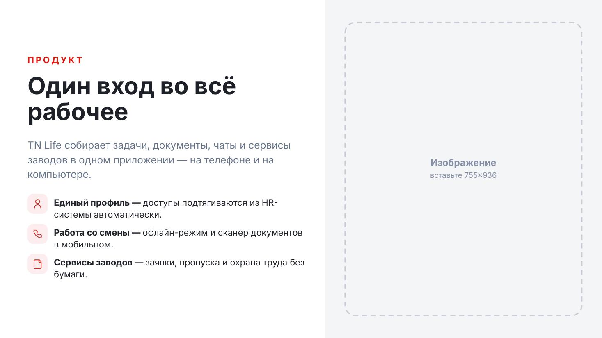
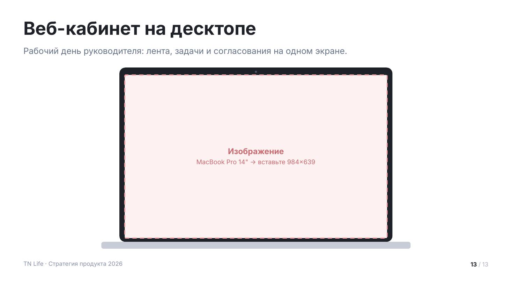

# Изображения

Два макета под скриншоты и фото. Если файла нет, оба рисуют пунктирный
плейсхолдер с точным размером в пикселях — дека собирается целиком даже без
единой картинки, а список недостающих изображений отдаётся пользователю.

Сниппеты предполагают подключённый пролог — см. [README.md](README.md).

## `split` — текст и изображение



Половина слайда — текст, половина — изображение на серой подложке. Основной
макет для рассказа о продукте.

Колонтитула нет намеренно: слайд читается как разворот. До 4 пунктов со своими
иконками, все в красном (`mono: false` включит чередование акцентов).
`side: 'left'` переносит изображение налево.

| Поле | Значение |
|---|---|
| `eyebrow` | надзаголовок |
| `title` | заголовок, до 2 строк |
| `lead` | абзац о сути |
| `items[]` | `{ icon, title, text }`, до 4 |
| `image` | путь к изображению |
| `imageNote` | подсказка для плейсхолдера |
| `side` | `right` (по умолчанию) или `left` |
| `ratio` | доля панели изображения, по умолчанию 0.46 |
| `mono` | `false` — чередовать акценты у иконок |

<details><summary>Сниппет</summary>

```js
async function split(p, d) {
  const s = p.addSlide();
  s.background = { color: TN.hex(C.bg) };
  const artRight = (d.side || 'right') === 'right';
  const artW = Math.round(W * (d.ratio || 0.46));
  const txW = W - artW;
  const ax = artRight ? txW : 0;

  TN.rect(s, p, { x: ax, y: 0, w: artW, h: H, fill: C.surface });
  TN.picture(s, p, { x: ax + 64, y: 72, w: artW - 128, h: H - 144, image: d.image, note: d.imageNote, r: 32 });

  const tx = artRight ? MX : artW + 64;
  const tw = txW - MX - 64;
  const items = d.items || [];
  const ft = TN.fit(d.title, { w: tw, h: 300, size: 76, min: 44, bold: true, lh: 1.1 });
  const th = ft.lines * ft.size * 1.1;
  const ldh = d.lead ? TN.blockH(d.lead, tw, T.lead, false, 1.45) + 44 : 0;

  let y = Math.max(MT, (H - ((d.eyebrow ? 60 : 0) + th + 36 + ldh + items.length * 96)) / 2);
  if (d.eyebrow) { TN.txt(s, d.eyebrow.toUpperCase(), { x: tx, y, w: tw, h: 40, size: 28, bold: true, color: C.red60, spacing: 2.6 }); y += 60; }
  TN.txt(s, d.title, { x: tx, y, w: tw, h: th + 8, size: ft.size, bold: true, lh: 1.1 });
  y += th + 36;
  if (d.lead) { TN.txt(s, d.lead, { x: tx, y, w: tw, h: ldh, size: T.lead, color: C.n60, lh: 1.45 }); y += ldh; }

  for (let i = 0; i < items.length; i++) {
    const it = items[i];
    const a = TN.accent(d.mono === false ? i : 0, it.tone);
    const iy = y + i * 96;
    TN.rect(s, p, { x: tx, y: iy, w: 64, h: 64, r: 18, fill: a.tint });
    if (!await TN.putIcon(s, it.icon, a.solid, { x: tx + 15, y: iy + 15, w: 34 })) TN.ellipse(s, p, { x: tx + 24, y: iy + 24, w: 16, h: 16, fill: a.solid });
    TN.txt(s, [
      ...(it.title ? [{ text: it.title + (it.text ? ' — ' : ''), bold: true }] : []),
      ...(it.text ? [{ text: it.text }] : []),
    ], { x: tx + 84, y: iy + 6, w: tw - 84, h: 84, size: T.body, lh: 1.35 });
  }
}
```
</details>

Пример вызова:

```js
await split(p, {
    eyebrow: 'Продукт',
    title: 'Один вход во всё рабочее',
    lead: 'TN Life собирает задачи, документы, чаты и сервисы заводов в одном приложении — на телефоне и на компьютере.',
    items: [
      { icon: 'user-light', title: 'Единый профиль', text: 'доступы подтягиваются из HR-системы автоматически.' },
      { icon: 'phone-light', title: 'Работа со смены', text: 'офлайн-режим и сканер документов в мобильном.' },
      { icon: 'document-light', title: 'Сервисы заводов', text: 'заявки, пропуска и охрана труда без бумаги.' },
    ],
  });
```

## `image` — крупное изображение



Скриншот или фото во весь контентный блок. Рамки: `laptop` — экран ноутбука
с подставкой, `phone` — корпус телефона, `none` — просто скруглённая картинка,
`square` — без скруглений.

Заголовок короткий, лид — одна строка: на этом слайде говорит картинка.
Под изображением можно поставить подпись `caption`.

| Поле | Значение |
|---|---|
| `title` | заголовок слайда |
| `lead` | одна строка контекста |
| `image` | путь к изображению |
| `imageNote` | подсказка для плейсхолдера |
| `caption` | подпись под изображением |
| `frame` | `none` / `laptop` / `phone` / `square` |
| `tone` | `light` — серый фон |

<details><summary>Сниппет</summary>

```js
function image(p, d) {
  const s = p.addSlide();
  s.background = { color: TN.hex(d.tone === 'light' ? C.surface : C.bg) };
  const y0 = TN.header(s, { ...d, maxH: 90 });
  const bottom = TN.contentBottom();
  const avail = bottom - y0;

  if (d.frame === 'laptop') {
    const lw = 1024, sw = 984, sh = Math.min(639, avail - 80);
    const x = (W - lw) / 2;
    TN.rect(s, p, { x, y: y0, w: lw, h: sh + 42, r: 22, fill: C.frame });
    TN.ellipse(s, p, { x: W / 2 - 4, y: y0 + 12, w: 8, h: 8, fill: '#4d5666' });
    TN.picture(s, p, { x: x + 20, y: y0 + 28, w: sw, h: sh, image: d.image, tone: 'rose', r: 4, note: d.imageNote });
    TN.rect(s, p, { x: (W - 1160) / 2, y: y0 + sh + 42, w: 1160, h: 26, r: 8, fill: C.n30 });
  } else if (d.frame === 'phone') {
    const ph = Math.min(858, avail), pw = Math.round(ph * 0.48);
    const x = (W - pw) / 2;
    TN.rect(s, p, { x, y: y0, w: pw, h: ph, r: 58, fill: C.frame });
    TN.picture(s, p, { x: x + 16, y: y0 + 16, w: pw - 32, h: ph - 32, image: d.image, tone: 'rose', r: 44, note: d.imageNote });
  } else {
    TN.picture(s, p, { x: MX, y: y0, w: CW, h: avail, image: d.image, note: d.imageNote, r: 32 });
  }
  if (d.caption) TN.txt(s, d.caption, { x: MX, y: bottom + 6, w: CW, h: 34, size: T.caption, color: C.n50 });
  chrome(s, p);
}
```
</details>

Пример вызова:

```js
image(p, {
    title: 'Веб-кабинет на десктопе',
    lead: 'Рабочий день руководителя: лента, задачи и согласования на одном экране.',
    frame: 'laptop',
    imageNote: 'MacBook Pro 14" → вставьте 984×639',
  });
```
