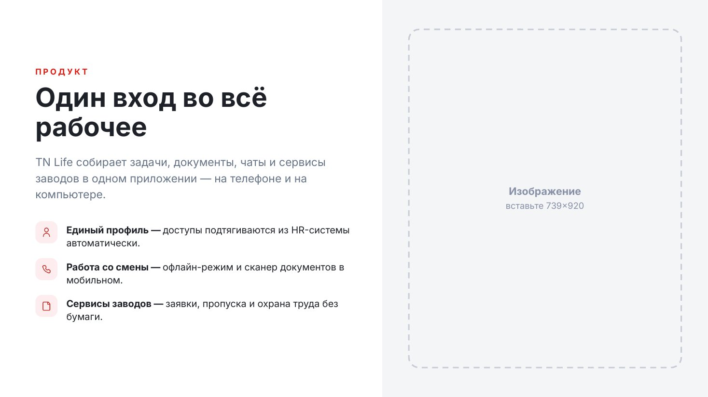
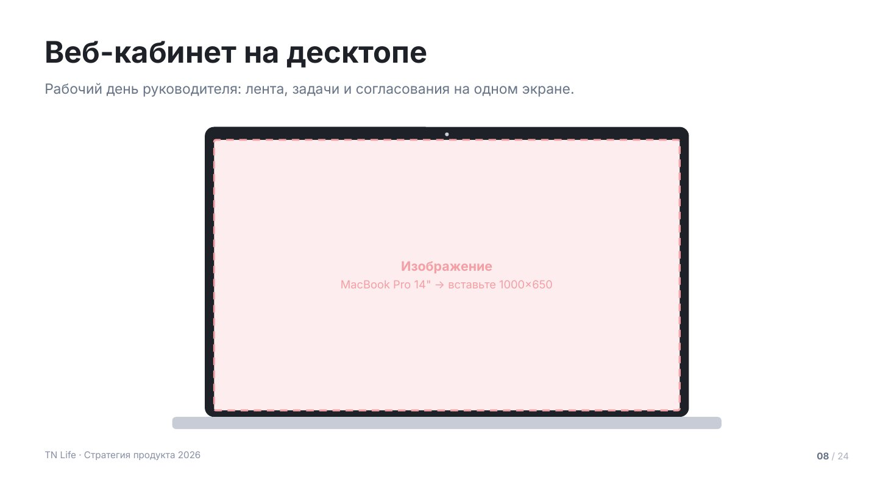
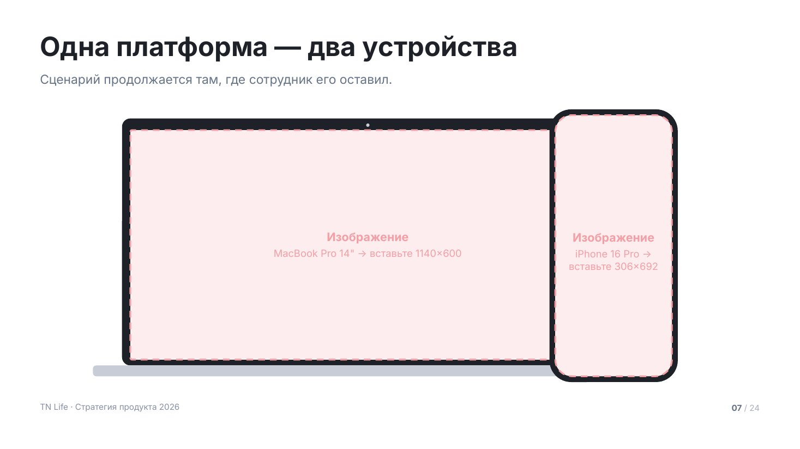

# Изображения

Два макета под скриншоты и фото. Если файла нет, оба рисуют пунктирный
плейсхолдер с точным размером в пикселях — дека собирается целиком даже без
единой картинки, а список недостающих изображений отдаётся пользователю.

Сниппеты предполагают подключённый пролог — см. [README.md](README.md).

## `split` — текст и изображение



Половина слайда — текст, половина — изображение на серой подложке. Основной
макет для рассказа о продукте.

Колонтитула нет намеренно: слайд читается как разворот. До 4 пунктов со своими
иконками, все в красном (`mono: false` включит чередование акцентов). Высота
каждого пункта считается по его тексту, поэтому длинное пояснение не наезжает
на следующую строку. `side: 'left'` переносит изображение налево.

| Поле | Значение |
|---|---|
| `eyebrow` | надзаголовок |
| `title` | заголовок, до 2 строк |
| `lead` | абзац о сути |
| `items[]` | `{ icon, title, text }`, до 4 |
| `image` | путь к изображению |
| `imageNote` | подсказка для плейсхолдера |
| `side` | `right` (по умолчанию) или `left` |
| `ratio` | доля панели изображения, по умолчанию 0.46 |
| `mono` | `false` — чередовать акценты у иконок |

<details><summary>Сниппет</summary>

```js
async function split(p, d) {
  const s = p.addSlide();
  s.background = { color: TN.hex(C.bg) };
  const artRight = (d.side || 'right') === 'right';
  const artW = Math.round(W * (d.ratio || 0.46));
  const txW = W - artW, ax = artRight ? txW : 0;

  TN.rect(s, p, { x: ax, y: 0, w: artW, h: H, fill: C.surface });
  TN.picture(s, p, { x: ax + 72, y: MT, w: artW - 144, h: H - MT * 2, image: d.image, note: d.imageNote, r: TN.R.big });

  const tx = artRight ? MX : artW + 72;
  const tw = txW - MX - 72;
  const items = (d.items || []).slice(0, 4);
  const iconW = 60, ix = tx + iconW + 24, iw = tw - iconW - 24;

  const ft = TN.fit(d.title, { w: tw, h: 300, size: 72, min: 44, bold: true, lh: 1.1 });
  const th = ft.lines * ft.size * 1.1;
  const ldh = d.lead ? TN.blockH(d.lead, tw, T.lead, false, 1.45) : 0;
  const rowH = items.map((it) => Math.max(iconW, TN.blockH([it.title, it.text].filter(Boolean).join(' — '), iw, T.body, false, 1.35)));
  const itemsH = rowH.reduce((a, b) => a + b, 0) + 30 * Math.max(0, items.length - 1);

  const need = (d.eyebrow ? 46 : 0) + th + (ldh ? 30 + ldh : 0) + (itemsH ? 56 + itemsH : 0);
  let y = TN.place(MT, H - MB, need, 0.44);

  if (d.eyebrow) {
    TN.txt(s, String(d.eyebrow).toUpperCase(), { x: tx, y, w: tw, h: 30, size: T.eyebrow, bold: true, color: C.accent, spacing: 2.4, font: TN.MONO || TN.FONT });
    y += 46;
  }
  TN.txt(s, d.title, { x: tx, y, w: tw, h: th + 8, size: ft.size, bold: true, lh: 1.1 });
  y += th;
  if (d.lead) { y += 30; TN.txt(s, d.lead, { x: tx, y, w: tw, h: ldh + 8, size: T.lead, color: C.muted, lh: 1.45 }); y += ldh; }
  if (itemsH) y += 56;

  for (let i = 0; i < items.length; i++) {
    const it = items[i];
    const a = TN.accent(d.mono === false ? i : 0, it.tone);
    const ok = await TN.tile(s, p, { x: tx, y, size: iconW, fill: a.tint, icon: it.icon, color: a.solid });
    if (!ok) TN.ellipse(s, p, { x: tx + 22, y: y + 22, w: 16, h: 16, fill: a.solid });
    TN.txt(s, [
      ...(it.title ? [{ text: it.title + (it.text ? ' — ' : ''), bold: true }] : []),
      ...(it.text ? [{ text: it.text }] : []),
    ], { x: ix, y: y + 4, w: iw, h: rowH[i] + 8, size: T.body, lh: 1.35 });
    y += rowH[i] + 30;
  }
}
```
</details>

Пример вызова:

```js
await split(p, {
    eyebrow: 'Продукт',
    title: 'Один вход во всё рабочее',
    lead: 'TN Life собирает задачи, документы, чаты и сервисы заводов в одном приложении — на телефоне и на компьютере.',
    items: [
      { icon: 'user-light', title: 'Единый профиль', text: 'доступы подтягиваются из HR-системы автоматически.' },
      { icon: 'phone-light', title: 'Работа со смены', text: 'офлайн-режим и сканер документов в мобильном.' },
      { icon: 'document-light', title: 'Сервисы заводов', text: 'заявки, пропуска и охрана труда без бумаги.' },
    ],
  });
```

## `image` — крупное изображение



Скриншот или фото во весь контентный блок. Рамки: `laptop` — экран ноутбука
с подставкой, `phone` — корпус телефона, `none` — просто скруглённая картинка,
`square` — без скруглений.

Заголовок короткий, лид — одна строка: на этом слайде говорит картинка.
Рамка центрируется в оставшейся зоне, под изображением можно поставить
подпись `caption`.

| Поле | Значение |
|---|---|
| `title` | заголовок слайда |
| `lead` | одна строка контекста |
| `image` | путь к изображению |
| `imageNote` | подсказка для плейсхолдера |
| `caption` | подпись под изображением |
| `frame` | `none` / `laptop` / `phone` / `square` |
| `tone` | `light` — серый фон |

<details><summary>Сниппет</summary>

```js
function image(p, d) {
  const s = p.addSlide();
  s.background = { color: TN.hex(d.tone === 'light' ? C.surface : C.bg) };
  const y0 = TN.header(s, { ...d, maxH: 90 });
  const bottom = TN.contentBottom() - (d.caption ? 44 : 0);
  const avail = bottom - y0;

  if (d.frame === 'laptop') {
    const lw = 1040, sw = 1000, sh = Math.min(650, avail - 90);
    const x = (W - lw) / 2;
    const y = TN.place(y0, bottom, sh + 42 + 26, 0.4);
    TN.rect(s, p, { x, y, w: lw, h: sh + 42, r: 20, fill: C.frame });
    TN.ellipse(s, p, { x: W / 2 - 4, y: y + 12, w: 8, h: 8, fill: C.lineStrong });
    TN.picture(s, p, { x: x + 20, y: y + 28, w: sw, h: sh, image: d.image, tone: 'rose', r: 4, note: d.imageNote });
    TN.rect(s, p, { x: (W - 1180) / 2, y: y + sh + 42, w: 1180, h: 26, r: 8, fill: C.lineStrong });
  } else if (d.frame === 'phone') {
    const ph = Math.min(avail, 860), pw = Math.round(ph * 0.48);
    const x = (W - pw) / 2;
    const y = TN.place(y0, bottom, ph, 0.4);
    TN.rect(s, p, { x, y, w: pw, h: ph, r: 56, fill: C.frame });
    TN.picture(s, p, { x: x + 16, y: y + 16, w: pw - 32, h: ph - 32, image: d.image, tone: 'rose', r: 42, note: d.imageNote });
  } else {
    TN.picture(s, p, { x: MX, y: y0, w: CW, h: avail, image: d.image, note: d.imageNote, r: d.frame === 'square' ? 0 : TN.R.big });
  }
  if (d.caption) TN.txt(s, d.caption, { x: MX, y: bottom + 12, w: CW, h: 32, size: T.caption, color: C.soft, align: 'center' });
  chrome(s, p);
}
```
</details>

Пример вызова:

```js
image(p, {
    title: 'Веб-кабинет на десктопе',
    lead: 'Рабочий день руководителя: лента, задачи и согласования на одном экране.',
    frame: 'laptop',
    imageNote: 'MacBook Pro 14" → вставьте 1000×650',
  });
```

## `devices` — два устройства



Ноутбук и телефон рядом: один сценарий на двух устройствах. Ставится там,
где важно показать не экран, а непрерывность — начал на смене в телефоне,
закончил в кабинете.

Скриншоты нужны оба. Если есть только один, это `image` с рамкой `laptop`
или `phone`, а не этот макет.

| Поле | Значение |
|---|---|
| `title` | заголовок слайда |
| `lead` | одна строка контекста |
| `desktop` | путь к скриншоту веб-кабинета |
| `mobile` | путь к скриншоту мобильного |
| `desktopNote` / `mobileNote` | подсказки для плейсхолдеров |
| `tone` | `light` — серый фон |

<details><summary>Сниппет</summary>

```js
function devices(p, d) {
  const s = p.addSlide();
  s.background = { color: TN.hex(d.tone === 'light' ? C.surface : C.bg) };
  const y0 = TN.header(s, { ...d, maxH: 90 });
  const bottom = TN.contentBottom();

  const lw = 1180, sw = lw - 40;                    // корпус ноутбука и его экран
  const sh = Math.min(600, bottom - y0 - 120);
  const ph = Math.min(sh + 120, bottom - y0 - 16);  // телефон выше ноутбука
  const pw = Math.round(ph * 0.47);
  const need = sh + 42 + 26;
  const top = TN.place(y0, bottom, need, 0.4);
  const x = Math.round((W - lw - pw * 0.5) / 2);

  TN.rect(s, p, { x, y: top, w: lw, h: sh + 42, r: 20, fill: C.frame });
  TN.ellipse(s, p, { x: x + lw / 2 - 4, y: top + 12, w: 8, h: 8, fill: C.lineStrong });
  TN.picture(s, p, { x: x + 20, y: top + 28, w: sw, h: sh, image: d.desktop, tone: 'rose', r: 4,
    note: d.desktopNote || `веб-кабинет → вставьте ${sw}×${sh}` });
  TN.rect(s, p, { x: x - 70, y: top + sh + 42, w: lw + 140, h: 26, r: 8, fill: C.lineStrong });

  const phx = x + lw - Math.round(pw * 0.5), phy = top + need - ph + 14;
  TN.rect(s, p, { x: phx, y: phy, w: pw, h: ph, r: 52, fill: C.frame });
  TN.rect(s, p, { x: phx + pw / 2 - 58, y: phy + 18, w: 116, h: 22, r: 11, fill: C.frame });
  TN.picture(s, p, { x: phx + 14, y: phy + 14, w: pw - 28, h: ph - 28, image: d.mobile, tone: 'rose', r: 40,
    note: d.mobileNote || `мобильное → вставьте ${pw - 28}×${ph - 28}` });
  chrome(s, p);
}
```
</details>

Пример вызова:

```js
devices(p, {
    title: 'Одна платформа — два устройства',
    lead: 'Сценарий продолжается там, где сотрудник его оставил.',
    desktopNote: 'MacBook Pro 14" → вставьте 1140×600',
    mobileNote: 'iPhone 16 Pro → вставьте 306×692',
  });
```
